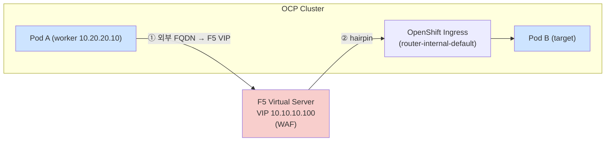

# OCP hostAliases 활용 — 외부 LB(F5 VIP) 헤어핀 방지

> OCP 클러스터 내부 애플리케이션이 서비스 hostname 대신 **외부 로드밸런서(F5 VIP)로 헤어핀(hairpin)** 되는 문제를, `hostAliases`로 외부 FQDN을 **내부 라우터 ClusterIP** 로 오버라이드하여 해결하는 사례.

## 변경이력 (Change History)

| 버전 | 일자 | 작성자 | 작성/검증 | 변경 내용 |
|------|------------|-------------|-----------|-----------|
| v1.0 | 2026-09-11 | k.s.k & kiro | 평문 → md 재작성 | Red Hat Solution 7147852(hostAliases 헤어핀 방지) 평문을 구조화된 마크다운으로 재작성 |
| v1.1 | 2026-09-11 | k.s.k & kiro | 참고자료 추가 + 링크 검증 | 네트워크 용어 hairpin(헤어핀 NAT / LB 헤어핀 / K8s hairpin mode) 특성·기술자료를 `<참고자료>`로 추가 |

> 출처: [Red Hat Solution 7147852 — Applications hosted in the OCP cluster hairpin through external load balancer instead of using service hostname](https://access.redhat.com/solutions/7147852) (Solution Verified). 아래 내용은 원문을 요약·재구성한 것입니다. *Content was rephrased for compliance with licensing restrictions.*

---

## 1. 환경 (Environment)

- Red Hat OpenShift Container Platform (RHOCP) **4.x**

## 2. 증상 (Issue)

- OCP 클러스터 내부 마이크로서비스들이 서로 통신할 때, **내부 클러스터 네트워킹 대신 외부 F5 Virtual Server(VIP `10.10.10.100`)로 트래픽을 라우팅**함.
- F5 WAF 팀 보고: OCP worker 노드(`10.20.20.10`, `10.20.20.11`, `10.20.20.12`)가 **F5 VIP를 통해 East-West 트래픽을 발생**시켜 WAF 위반이 트리거됨.
- 비효율적 **헤어핀 패턴**: `Pod → F5 VIP → OpenShift Ingress → Pod`.
- 원인 배경: 서드파티 뱅킹 애플리케이션이 설정에서 **외부 URL(F5 VIP로 resolve되는 FQDN)** 을 사용.
- 표준 해법(내부 K8s 서비스 DNS명 `service-name.namespace.svc.cluster.local` 사용)을 적용할 수 없음 → 앱이 **단일 server-identity 설정 블록**을 사용하며, 그 블록이 **외부 인터넷 뱅킹 클라이언트에게 노출되는 URL도 함께 게시**하기 때문.



---

## 3. 해결 방법 (Resolution)

**워크어라운드:** 애플리케이션 Deployment에 `hostAliases`를 사용하여, 외부 FQDN의 DNS resolution을 **내부 라우터 ClusterIP** 로 오버라이드한다.

### 3.1 라우터 ClusterIP 확인

`openshift-ingress` 네임스페이스의 `router-internal-default` Service ClusterIP를 확인:

```bash
$ oc get svc router-internal-default -n openshift-ingress -o jsonpath='{.spec.clusterIP}'
```

예시 출력:

```text
10.30.30.50
```

### 3.2 Deployment에 hostAliases 추가

각 애플리케이션 Deployment 편집:

```bash
$ oc edit deployment <application-deployment-name> -n fabricprod
```

`spec.template.spec` 하위에 아래 설정 추가:

```yaml
spec:
  template:
    spec:
      hostAliases:
        - ip: 10.30.30.50
          hostnames:
            - domain.example.com
```

저장하면 Pod가 새 설정으로 자동 재생성된다.

### 3.3 검증

애플리케이션 Pod가 외부 FQDN을 내부 ClusterIP로 resolve하는지 확인:

```bash
$ oc exec <application-pod-name> -n fabricprod -- getent hosts domain.example.com
```

기대 출력:

```text
10.30.30.50   domain.example.com
```

Pod 내부 `/etc/hosts`에 오버라이드가 반영되었는지 확인:

```bash
$ oc exec <application-pod-name> -n fabricprod -- cat /etc/hosts
```

기대 출력(포함되어야 함):

```text
# Entries added by HostAliases.
10.30.30.50   domain.example.com
```

이후 F5 WAF 로그를 모니터링하여 East-West 트래픽이 더 이상 외부 VIP를 경유하지 않음을 확인한다.

### 3.4 중요 참고사항 (Important notes)

- `router-internal-default` Service의 ClusterIP는 일반적인 클러스터 운영 중에는 **안정적**이지만, Service가 **삭제 후 재생성되면 보장되지 않는다.** 이 의존성을 운영 런북에 문서화할 것.
- 애플리케이션이 **오퍼레이터로 배포**된 경우, Deployment에 직접 넣지 말고 **오퍼레이터의 Custom Resource에 `hostAliases`를 설정**해야 오퍼레이터가 설정을 덮어쓰지 않는다.
- **클러스터 업그레이드 후**, `hostAliases` 설정이 유지되고 Pod가 여전히 FQDN을 내부 ClusterIP로 resolve하는지 검증할 것.

---

## 4. 근본 원인 (Root Cause)

- 서드파티 뱅킹 애플리케이션이 ConfigMap에서 **단일 server-identity 설정 블록**(`DOCKER_HOST`, `DOCKER_PORT`, `FABRIC_PORT`, `HTTP_PROTOCOL`)을 사용하여 **내부 service-to-service URL과 외부 client-facing URL을 모두 구성**한다.
- 앱이 내부/외부 엔드포인트 변수를 **분리 제공하지 않으므로**, hostname을 내부 K8s 서비스명으로 바꾸면 라우팅 불가한 `.svc.cluster.local` hostname이 모바일/웹 클라이언트에 게시되어 **외부 클라이언트 연결이 깨진다.**

---

## 5. 진단 단계 (Diagnostic Steps)

### 5.1 Pod가 외부 FQDN을 F5 VIP로 resolve하는지 확인

```bash
$ oc exec <application-pod-name> -n fabricprod -- nslookup domain.example.com
```

출력(외부 F5 VIP를 가리킴):

```text
Server:         10.30.0.10
Address:        10.30.0.10#53

Non-authoritative answer:
Name:   domain.example.com
Address: 10.10.10.100
```

### 5.2 애플리케이션 설정에서 사용 중인 외부 URL 식별

```bash
$ oc get configmap -n fabricprod | grep conf
$ oc get configmap <application-configmap-name> -n fabricprod -o yaml
```

다음과 같은 항목 확인:

```text
DOCKER_HOST: domain.example.com
HTTP_PROTOCOL: https
FABRIC_PORT: 443
DOCKER_PORT: 8080
```

### 5.3 F5 WAF 로그 검토

VIP를 통해 East-West 트래픽을 생성하는 소스 IP 식별. F5 팀이 **OCP worker 노드가 외부 VIP를 히트하는** 로그를 제공해야 함.

### 5.4 내부 라우터에 외부 FQDN용 Route 존재 확인

```bash
$ oc get routes -A | grep domain.example.com
```

### 5.5 라우터 ClusterIP 식별

```bash
$ oc get svc router-internal-default -n openshift-ingress -o jsonpath='{.spec.clusterIP}'
```

### 5.6 hostAliases 적용 후 설정 반영 확인

```bash
$ oc exec <application-pod-name> -n fabricprod -- cat /etc/hosts | grep domain
```

### 5.7 내부 통신 정상 여부 테스트

```bash
$ oc exec <application-pod-name> -n fabricprod -- curl -k https://domain.example.com/<api-path>
```

---

## 6. 분류 (Metadata)

| 항목 | 값 |
|------|-----|
| Product(s) | Red Hat OpenShift Container Platform |
| Component | Networking |
| Category | Configure |
| Tags | Fabric networking, ocp_4, openshift, route, service-endpoint, shift_networking |

> 본 솔루션은 Red Hat의 fast-track 발행 프로그램의 일부로, raw/미편집 형태로 제공될 수 있습니다(원문 고지). 상기 문서는 원문을 요약·재구성한 것이며, 정확한 원문은 [출처 링크](https://access.redhat.com/solutions/7147852)를 참조하세요.


---

# &lt;참고자료&gt; 네트워크 용어 "hairpin(헤어핀)" 특성 및 기술자료

> 본 사례의 핵심 원인인 **hairpin(헤어핀)** 을 처음 접하는 사용자도 관련 기술까지 함께 이해하고 문서를 개선해 갈 수 있도록 정리했습니다. 아래 내용은 각 출처를 요약·재구성한 것입니다. *Content was rephrased for compliance with licensing restrictions.*

## A. hairpin이란 (용어의 어원)

**hairpin(헤어핀)** 은 트래픽이 어떤 장치(라우터/방화벽/로드밸런서)까지 갔다가 **머리핀(U자)처럼 방향을 되돌려**, 들어온 쪽과 같은 방향(같은 세그먼트/같은 노드)으로 다시 나가는 흐름을 말합니다.

- 어원: 클라이언트 트래픽이 NAT를 수행하는 라우터/방화벽까지 도달한 뒤, 주소 변환을 거쳐 **머리핀처럼 되꺾여** 내부 네트워크로 되돌아가 서버의 사설 IP에 접근하기 때문에 "hairpin"이라 부름. 원문 내용을 재구성함. [Cisco: Configure Hairpin with Firepower Management Center](https://www.cisco.com/c/en/us/support/docs/security/secure-firewall-management-center/221985-configure-hairpin-with-firepower-managem.html)


## B. Hairpin NAT (NAT loopback / NAT reflection)

가장 전통적인 형태로, **NAT loopback** 또는 **NAT reflection** 이라고도 부릅니다.

- 정의: 사설 네트워크의 장치가 **같은 사설 네트워크의 다른 장치를 "공인 IP"를 통해** 접근할 수 있게 하는 라우팅 기법. 원문 내용을 재구성함. [Cisco: Configure Hairpin on ASA](https://www.cisco.com/c/en/us/support/docs/security/secure-firewall-threat-defense/221949-configure-hairpin-on-asa.html)
- 동작: 사설 클라이언트가 공인 IP로 보낸 트래픽이 NAT 장치로 들어오면, **VIP 오브젝트를 통해 서버의 사설 주소로 목적지 변환(DNAT)** 후 같은(또는 인접) 내부 인터페이스로 되돌려 라우팅. 원문 내용을 재구성함. [Fortinet Hairpin NAT 구성 가이드](https://0nol.com/fortinet/hairpin-nat-fortigate-configuration-guide.html)
- 목적: 내부/외부에서 **동일한 방식(같은 URL/공인 IP)** 으로 서비스에 접근 가능하게 함. 원문 내용을 재구성함. [Juniper: NAT Hairpinning 예시](https://www.juniper.net/documentation/en_US/junos12.1x46/topics/example/nat-hairpinning-configuring.html)
- 왜 SNAT가 함께 필요한가: 헤어핀 시 소스가 내부 클라이언트 그대로면 서버가 **NAT 장치를 거치지 않고 클라이언트에 직접 응답**하려 해 세션이 비대칭(asymmetric)이 되어 깨질 수 있음. 그래서 소스도 NAT 장치 주소로 바꿔(SNAT) **응답이 반드시 NAT 장치로 되돌아오게** 해야 함. (LTM SNAT AutoMap 원리와 동일 — 본 저장소 [F5 CIS ClusterIP 문서](../ovn-gateway-network-flow/f5-cis-integration/01-f5-cis-clusterip-ovn-architecture.md) §4.3 참조)

> Content was rephrased for compliance with licensing restrictions.

## C. 로드밸런서(LB) Hairpinning

클라우드/쿠버네티스 환경에서 자주 겪는 형태입니다.

- 정의: **Pod가 공인 로드밸런서 IP로 접속했는데, 그 패킷이 되돌아와 같은 쪽(같은 노드/같은 클러스터)의 Pod로 향하는** 흐름. 원문 내용을 재구성함. [Syself: Handle load balancer hairpinning](https://syself.com/docs/hetzner/apalla/network/load-balancing/hairpinning)
- **본 문서의 사례가 바로 이것**입니다: `Pod → F5 VIP → OpenShift Ingress → Pod`. 내부 통신인데 외부 VIP를 경유하여 (1) 불필요한 지연/대역 낭비, (2) 외부 LB/WAF 부하·정책 위반, (3) 소스 IP 왜곡이 발생. → 해결책이 **hostAliases로 외부 FQDN을 내부 ClusterIP로 오버라이드**하여 헤어핀을 끊는 것(본문 §3).

## D. Kubernetes hairpin mode

컨테이너 네트워킹 레벨의 별개 개념(이름만 같음)으로, **"Pod가 자기 자신을 Service를 통해 호출"** 하는 경우를 위한 브리지 설정입니다.

- 정의/동작: hairpin mode는 브리지가 **들어온 인터페이스로 패킷을 다시 내보내도록 허용**하는 설정. kube-proxy가 Service DNAT를 처리하며, 헤어핀 케이스에서는 **연결을 SNAT로 마킹**하여 반환 트래픽이 (직접 pod-to-pod 응답이 아니라) 기대한 NAT 경로를 따르게 함. 원문 내용을 재구성함. [oneuptime: hairpin mode for pod-to-self via service](https://oneuptime.com/blog/post/2026-02-09-hairpin-mode-pod-self-service/view)
- 관련: Service/네트워킹 디버깅 및 소스 IP(SNAT) 동작은 쿠버네티스 공식 문서 참조. [Kubernetes: Debug Services](https://kubernetes.io/docs/tasks/debug/debug-application/debug-service/), [Kubernetes: Using Source IP](https://kubernetes.io/docs/tutorials/services/source-ip/)

> 주의: **"Hairpin NAT / LB hairpinning"**(트래픽이 외부 IP를 경유해 U턴)과 **"K8s hairpin mode"**(Pod가 Service로 자기 자신 호출 시 브리지 설정)는 **이름은 같지만 다른 계층의 개념**입니다. 본 사례의 문제는 전자(LB hairpinning)입니다.

## E. 용어 비교 요약

| 용어 | 계층 | 핵심 의미 | 본 사례 관련 |
|------|------|-----------|:-----------:|
| Hairpin NAT (NAT loopback/reflection) | 라우터/방화벽 NAT | 내부에서 공인 IP로 내부 서버 접근(주소변환 후 U턴) | 배경 개념 |
| LB Hairpinning | 로드밸런서/클라우드/K8s | 내부 트래픽이 외부 LB IP를 경유해 같은 쪽으로 되돌아옴 | **★ 본 문제** |
| K8s hairpin mode | CNI/브리지 | Pod가 Service 통해 자기 자신 호출 허용(브리지 설정) | 이름만 유사(별개) |

## F. hairpin이 문제가 되는 이유 (정리)

1. **성능/비용:** 내부에서 끝날 통신이 외부 장치까지 왕복 → 지연·대역 낭비.
2. **보안/정책:** 외부 WAF/LB가 내부(East-West) 트래픽까지 검사 → 오탐/위반, 부하 증가.
3. **소스 IP 왜곡:** NAT/SNAT로 실제 소스가 가려져 ACL·로깅·감사에 악영향.
4. **가용성 결합:** 내부 통신이 외부 LB 가용성에 종속 → 외부 장치 장애가 내부 통신까지 중단.

> 개선 방향: 가능하면 **내부 서비스 DNS(`*.svc.cluster.local`) 사용**이 정석이며, 애플리케이션 제약(내부/외부 URL 분리 불가)으로 불가능할 때 **hostAliases(본문)** 또는 **split-horizon DNS** 로 내부 경로를 우회 없이 만든다.

## G. 출처 (링크 검증 결과)

| 출처 | 링크 | 상태 |
|------|------|------|
| Cisco: Configure Hairpin on ASA (NAT loopback/reflection 정의) | https://www.cisco.com/c/en/us/support/docs/security/secure-firewall-threat-defense/221949-configure-hairpin-on-asa.html | 페이지 유효(스크립트 403 봇차단) |
| Cisco: Configure Hairpin with Firepower (어원) | https://www.cisco.com/c/en/us/support/docs/security/secure-firewall-management-center/221985-configure-hairpin-with-firepower-managem.html | 페이지 유효(스크립트 403 봇차단) |
| Juniper: NAT Hairpinning 예시 | https://www.juniper.net/documentation/en_US/junos12.1x46/topics/example/nat-hairpinning-configuring.html | 참고 |
| Fortinet Hairpin NAT 구성 가이드 | https://0nol.com/fortinet/hairpin-nat-fortigate-configuration-guide.html | 참고 |
| JumpCloud: What is Hairpinning NAT | https://jumpcloud.com/it-index/what-is-hairpinning-nat | 200 OK |
| Syself: Handle load balancer hairpinning | https://syself.com/docs/hetzner/apalla/network/load-balancing/hairpinning | 참고 |
| oneuptime: hairpin mode for pod-to-self via service | https://oneuptime.com/blog/post/2026-02-09-hairpin-mode-pod-self-service/view | 참고 |
| Kubernetes: Debug Services | https://kubernetes.io/docs/tasks/debug/debug-application/debug-service/ | 200 OK |
| Kubernetes: Using Source IP | https://kubernetes.io/docs/tutorials/services/source-ip/ | 200 OK |

> cisco.com은 자동화 클라이언트(User-Agent 기반)에 403(봇 차단)을 반환하지만 브라우저/조회도구로는 정상 접근됩니다(끊어진 링크 아님).
