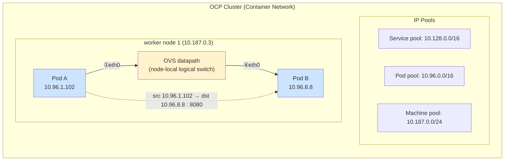

# 분석 - 시나리오 1 : Pod A → Pod B (동일 노드, port 8080)

## 변경이력 (Change History)

| 버전 | 일자 | 작성자 | 작성/검증 | 변경 내용 |
|------|------------|-------------|-----------|-----------|
| v1.0 | 2026-09-11 | k.s.k & kiro | 1차 생성 + 자체 교차검증 | 시나리오1(동일 노드 East-West) 비교 1~4안 패킷 분석 최초 작성 |

> 개념 근거는 [`../references/01-ovn-gateway-concepts.md`](../references/01-ovn-gateway-concepts.md), 환경/관측지점은 [`../references/02-cluster-environment.md`](../references/02-cluster-environment.md), 출처는 [`../references/03-glossary-and-sources.md`](../references/03-glossary-and-sources.md) 참조.

---

## 1. 시나리오 개요

| 항목 | 값 |
|------|-----|
| 소스 | Pod A `10.96.1.102` (worker node 1 `10.187.0.3`) |
| 타겟 | Pod B `10.96.8.8` (worker node 1 `10.187.0.3`) |
| 포트 | TCP 8080 |
| 트래픽 유형 | East-West, **동일 노드 내부** |
| 대상 접근 방식 | Pod IP 직접(또는 동일 노드 ClusterIP 백엔드) |

동일 노드의 두 Pod는 같은 노드의 OVN 논리 스위치에 연결됩니다. 트래픽은 **노드 내부 OVS 데이터패스 안에서만** 스위칭되며, 물리 NIC나 호스트 라우팅, GENEVE 캡슐화를 **거치지 않습니다.** 소스 IP는 SNAT 없이 원본 Pod A IP가 보존됩니다.

---

## 2. 구성도 (동일 노드 East-West)



### tcpdump 관측 지점 (지점1 PodA / 지점2·3 node1 / 지점4 PodB)

```
[지점1] Pod A eth0        : src 10.96.1.102:<eph>  → dst 10.96.8.8:8080
[지점2] worker node 1     : OVS 내부(br-int) 스위칭 - 물리 NIC 미통과
[지점3] worker node 1     : OVS 내부(br-int) 스위칭 - 물리 NIC 미통과
[지점4] Pod B eth0        : src 10.96.1.102:<eph>  → dst 10.96.8.8:8080
```

> 지점2/3은 "worker node 1"의 동일 노드 관측점입니다. 동일 노드 Pod 간 트래픽은 `br-int`(통합 브리지) 내부에서 스위칭되어 `br-ex`/물리 NIC/`ovn-k8s-mp0`로 나가지 않습니다. 따라서 물리 NIC(`ens*`)에서는 이 패킷이 보이지 않고, `br-int` 상에서 원본 Pod IP 그대로 관측됩니다.

---

## 3. 비교 1안 ~ 4안 패킷 분석

동일 노드 East-West 트래픽은 **gateway mode(`routingViaHost`)와 `ipForwarding` 값 모두와 무관**합니다. 두 파라미터는 north-south egress 및 "노드의 비 OVN 라우터 역할"을 제어하므로, 노드 내부 OVS 스위칭 경로에는 영향을 주지 않습니다.

- 근거: 동일 노드 Pod 간은 OVN 논리 스위치 내부 처리 → 호스트 라우팅/물리 NIC 무관. ClusterIP 내부 접근 시 소스 IP 보존(SNAT 없음). 원문 내용을 재구성함. [Kubernetes: Using Source IP](https://kubernetes.io/docs/tutorials/services/source-ip/), [OVN-Kubernetes: bridge-flows](https://ovn-kubernetes.io/master/design/bridge-flows/)

| 비교안 | 설정 | 지점1(Pod A) | 지점2(node1) | 지점3(node1) | 지점4(Pod B) | 통신 |
|--------|------|--------------|--------------|--------------|--------------|:---:|
| **1안** | rvh=true, ipfwd=Global | src `10.96.1.102` → dst `10.96.8.8`:8080 | br-int 내부 스위칭(동일) | br-int 내부 스위칭(동일) | src `10.96.1.102` → dst `10.96.8.8`:8080 | **O** |
| **2안** | rvh=true, ipfwd=Restricted | src `10.96.1.102` → dst `10.96.8.8`:8080 | br-int 내부 스위칭(동일) | br-int 내부 스위칭(동일) | src `10.96.1.102` → dst `10.96.8.8`:8080 | **O** |
| **3안** | rvh=false, ipfwd=Global | src `10.96.1.102` → dst `10.96.8.8`:8080 | br-int 내부 스위칭(동일) | br-int 내부 스위칭(동일) | src `10.96.1.102` → dst `10.96.8.8`:8080 | **O** |
| **4안** | rvh=false, ipfwd=Restricted (기본) | src `10.96.1.102` → dst `10.96.8.8`:8080 | br-int 내부 스위칭(동일) | br-int 내부 스위칭(동일) | src `10.96.1.102` → dst `10.96.8.8`:8080 | **O** |

- `<eph>` = 소스 Pod의 임시 포트(ephemeral). 4개 안 모두 소스/타겟 IP:port 변화 없음(SNAT/DNAT 없음).

---

## 4. 안별 OVN 통신 정책 요약 · 전제사항 · 가능 여부

| 항목 | 내용 |
|------|------|
| OVN 통신 정책 요약 | 동일 노드 Pod 간 트래픽은 노드-로컬 논리 스위치에서 L2/L3 처리. 오버레이 캡슐화·호스트 라우팅·SNAT 모두 미개입. |
| 네트워크 전제사항 | (1) 두 Pod가 동일 노드에 스케줄. (2) NetworkPolicy로 8080 인그레스가 차단되지 않아야 함. (3) 대상 앱이 8080 리슨. |
| 통신 가능 여부 | 1안 O · 2안 O · 3안 O · 4안 O (설정 무관, 항상 가능) |

> 요약: **시나리오1은 4개 안 모두 통신 가능(O)** 하며, 패킷의 소스/타겟 IP:port도 4개 안에서 동일합니다. `routingViaHost`/`ipForwarding`는 동일 노드 East-West 통신 결과를 바꾸지 않습니다.
