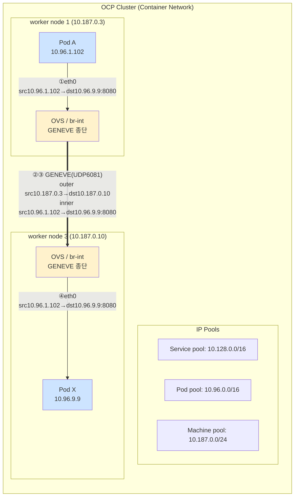

# 분석 - 시나리오 2 : Pod A → Pod X (노드 간 cross-node, port 8080)

## 변경이력 (Change History)

| 버전 | 일자 | 작성자 | 작성/검증 | 변경 내용 |
|------|------------|-------------|-----------|-----------|
| v1.0 | 2026-09-11 | k.s.k & kiro | 1차 생성 + 자체 교차검증 | 시나리오2(노드 간 East-West) 비교 1~4안 패킷 분석 최초 작성 |

> 개념 근거는 [`../references/01-ovn-gateway-concepts.md`](../references/01-ovn-gateway-concepts.md), 환경/관측지점은 [`../references/02-cluster-environment.md`](../references/02-cluster-environment.md), 출처는 [`../references/03-glossary-and-sources.md`](../references/03-glossary-and-sources.md) 참조.

---

## 1. 시나리오 개요

| 항목 | 값 |
|------|-----|
| 소스 | Pod A `10.96.1.102` (worker node 1 `10.187.0.3`) |
| 타겟 | Pod X `10.96.9.9` (worker node 3 `10.187.0.10`) |
| 포트 | TCP 8080 |
| 트래픽 유형 | East-West, **노드 간(cross-node)** |
| 캡슐화 | GENEVE (UDP 6081), 노드 물리망 구간 |

서로 다른 노드의 Pod 간 통신은 **GENEVE 오버레이**로 캡슐화되어 노드1의 물리 IP(`10.187.0.3`) ↔ 노드3의 물리 IP(`10.187.0.10`) 사이를 이동합니다. 오버레이 **내부(inner) 패킷의 소스/타겟 IP는 원본 Pod IP가 그대로 보존**되며, 외부(outer) 헤더만 노드 IP + UDP 6081로 감싸집니다. 즉 소스 Pod IP는 SNAT되지 않습니다.

- 근거: OVN-Kubernetes는 클러스터 내부 East/West 트래픽에 GENEVE를 사용. 원문 내용을 재구성함. [F5 clouddocs: OpenShift 4.8 & CIS OVN-Kubernetes](https://clouddocs.f5.com/containers/latest/userguide/openshift/openshift-4-8-cluster.html)
- 근거: ClusterIP/내부 통신은 소스 IP 보존(SNAT 없음, iptables 모드). 원문 내용을 재구성함. [Kubernetes: Using Source IP](https://kubernetes.io/docs/tutorials/services/source-ip/)

> Content was rephrased for compliance with licensing restrictions.

---

## 2. 구성도 (노드 간 East-West + GENEVE)



### tcpdump 관측 지점 (지점1 PodA / 지점2 node1 / 지점3 node3 / 지점4 PodX)

```
[지점1] Pod A eth0        : src 10.96.1.102:<eph> → dst 10.96.9.9:8080          (원본)
[지점2] worker node 1 NIC : [outer] src 10.187.0.3   → dst 10.187.0.10  UDP 6081 (GENEVE)
                            [inner] src 10.96.1.102   → dst 10.96.9.9:8080
[지점3] worker node 3 NIC : [outer] src 10.187.0.3   → dst 10.187.0.10  UDP 6081 (GENEVE)
                            [inner] src 10.96.1.102   → dst 10.96.9.9:8080
[지점4] Pod X eth0        : src 10.96.1.102:<eph> → dst 10.96.9.9:8080          (원본, 디캡슐 후)
```

> 노드 NIC(지점2/3)에서는 `tcpdump -ni <nic> udp port 6081` 로 GENEVE outer 헤더가 노드 IP 간 통신으로 관측되고, 캡슐 내부(inner)에는 원본 Pod IP가 그대로 들어 있습니다. Pod netns(지점1/4)에서는 항상 원본 Pod IP로 관측됩니다.

---

## 3. 비교 1안 ~ 4안 패킷 분석

노드 간 East-West(GENEVE 오버레이) 트래픽도 **gateway mode(`routingViaHost`) 및 `ipForwarding` 값과 무관**하게 동일하게 동작합니다. 이 경로는 OVN 오버레이가 전담하므로, 호스트 커널의 일반 라우팅/포워딩 정책(`ipForwarding`)이나 egress gateway 경로(`routingViaHost`)의 영향을 받지 않습니다.

- 전제: 노드 간 GENEVE(UDP 6081) 및 오버레이 관리 트래픽은 machine 네트워크(`10.187.0.0/24`)에서 노드 간 허용되어야 함(방화벽/보안그룹). 이는 OVN이 관리하는 트래픽이므로 `ipForwarding: Restricted`에서도 정상. 근거: 포워딩 sysctl은 OVN 인터페이스에 설정되어 k8s 관련 트래픽은 Restricted에서도 정상 포워딩. 원문 내용을 재구성함. [OVN-Kubernetes Config Variables](https://raw.githubusercontent.com/ovn-kubernetes/ovn-kubernetes/master/docs/getting-started/configuration.md), [Red Hat Solution 7053694](https://access.redhat.com/solutions/7053694)

> Content was rephrased for compliance with licensing restrictions.

| 비교안 | 설정 | 지점1(Pod A) | 지점2(node1 NIC) | 지점3(node3 NIC) | 지점4(Pod X) | 통신 |
|--------|------|--------------|------------------|------------------|--------------|:---:|
| **1안** | rvh=true, ipfwd=Global | src`10.96.1.102`→dst`10.96.9.9`:8080 | outer `10.187.0.3`→`10.187.0.10` UDP6081 / inner `10.96.1.102`→`10.96.9.9`:8080 | 동일(디캡슐 전) | src`10.96.1.102`→dst`10.96.9.9`:8080 | **O** |
| **2안** | rvh=true, ipfwd=Restricted | src`10.96.1.102`→dst`10.96.9.9`:8080 | outer `10.187.0.3`→`10.187.0.10` UDP6081 / inner `10.96.1.102`→`10.96.9.9`:8080 | 동일(디캡슐 전) | src`10.96.1.102`→dst`10.96.9.9`:8080 | **O** |
| **3안** | rvh=false, ipfwd=Global | src`10.96.1.102`→dst`10.96.9.9`:8080 | outer `10.187.0.3`→`10.187.0.10` UDP6081 / inner `10.96.1.102`→`10.96.9.9`:8080 | 동일(디캡슐 전) | src`10.96.1.102`→dst`10.96.9.9`:8080 | **O** |
| **4안** | rvh=false, ipfwd=Restricted (기본) | src`10.96.1.102`→dst`10.96.9.9`:8080 | outer `10.187.0.3`→`10.187.0.10` UDP6081 / inner `10.96.1.102`→`10.96.9.9`:8080 | 동일(디캡슐 전) | src`10.96.1.102`→dst`10.96.9.9`:8080 | **O** |

- 4개 안 모두: inner(원본) 소스/타겟 IP:port 동일, outer는 노드 IP 간 GENEVE로 동일.

---

## 4. 안별 OVN 통신 정책 요약 · 전제사항 · 가능 여부

| 항목 | 내용 |
|------|------|
| OVN 통신 정책 요약 | 서로 다른 노드의 Pod 간 트래픽은 GENEVE(UDP 6081)로 캡슐화되어 노드 IP 간 전송. inner 헤더의 Pod IP는 SNAT 없이 보존, 목적지 노드에서 디캡슐 후 Pod X로 전달. |
| 네트워크 전제사항 | (1) machine pool(`10.187.0.0/24`)에서 노드 간 UDP 6081(GENEVE) 및 OVN 제어 트래픽 허용. (2) NetworkPolicy로 8080 인그레스 미차단. (3) 대상 앱 8080 리슨. (4) 노드 간 MTU 여유(오버레이 오버헤드 고려). |
| 통신 가능 여부 | 1안 O · 2안 O · 3안 O · 4안 O (설정 무관, 항상 가능) |

> 요약: **시나리오2도 4개 안 모두 통신 가능(O)** 이며, 패킷 표현(inner 원본 + outer GENEVE)이 4개 안에서 동일합니다. `routingViaHost`/`ipForwarding`는 노드 간 East-West 통신 결과를 바꾸지 않습니다. 단, 노드 간 통신이므로 machine 네트워크에서 GENEVE(UDP 6081) 허용이 전제입니다(시나리오1과의 차이점).
