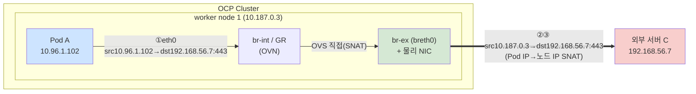
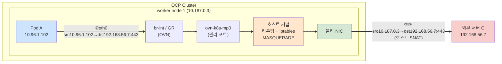

# 분석 - 시나리오 3 : Pod A → 외부 서버 C (North-South egress, port 443)

## 변경이력 (Change History)

| 버전 | 일자 | 작성자 | 작성/검증 | 변경 내용 |
|------|------------|-------------|-----------|-----------|
| v1.0 | 2026-09-11 | k.s.k & kiro | 1차 생성 + 자체 교차검증 | 시나리오3(외부 egress) 비교 1~4안 패킷 분석 최초 작성. gateway mode별 egress 경로 및 SNAT 차이 반영 |

> 개념 근거는 [`../references/01-ovn-gateway-concepts.md`](../references/01-ovn-gateway-concepts.md), 환경/관측지점은 [`../references/02-cluster-environment.md`](../references/02-cluster-environment.md), 출처는 [`../references/03-glossary-and-sources.md`](../references/03-glossary-and-sources.md) 참조.

---

## 1. 시나리오 개요

| 항목 | 값 |
|------|-----|
| 소스 | Pod A `10.96.1.102` (worker node 1 `10.187.0.3`) |
| 타겟 | 외부 서버 C `192.168.56.7` |
| 포트 | TCP 443 |
| 트래픽 유형 | North-South, **외부 egress** |
| 소스 IP 변환 | Pod IP → **노드 IP로 SNAT(masquerade)** |

외부(클러스터 밖) 목적지로 나가는 트래픽은 **소스 Pod IP가 노드 IP(`10.187.0.3`)로 SNAT(masquerade)** 되어 나갑니다. 따라서 외부 서버 C 입장에서 보이는 소스 IP는 항상 노드 IP입니다. 여기서 `routingViaHost`(gateway mode)는 **egress가 어느 경로로 나가는지**(호스트 커널 경유 vs OVS 직접)를 결정합니다.

- 근거(egress SNAT/masquerade): OVN-Kubernetes는 외부 브리지(breth0)에서 중간 SNAT 주소로 masquerade IP를 사용. 원문 내용을 재구성함. [OVN-Kubernetes: Masquerade IPs](https://ovn-kubernetes.io/master/design/masquerade-ips/)
- 근거(gateway mode 경로차): Shared는 OVS 데이터패스에 머물러 breth0로 직접 나가고, Local은 관리 포트(`ovn-k8s-mp0`)로 호스트 커널에 나간 뒤 호스트가 라우팅. 원문 내용을 재구성함. [OVN-Kubernetes: bridge-flows](https://ovn-kubernetes.io/master/design/bridge-flows/), [OKD: Configuring a gateway](https://docs.okd.io/4.19/networking/ovn_kubernetes_network_provider/configuring-gateway.html)

> Content was rephrased for compliance with licensing restrictions.

---

## 2. 구성도 (외부 egress) — gateway mode별 경로

### 2.1 Shared Gateway (`routingViaHost:false`, 3·4안)



### 2.2 Local Gateway (`routingViaHost:true`, 1·2안)



### tcpdump 관측 지점 (지점1 PodA / 지점2 node1 / 지점3 외부서버C)

```
[지점1] Pod A eth0            : src 10.96.1.102:<eph> → dst 192.168.56.7:443     (SNAT 전)
[지점2] worker node 1 egress  : src 10.187.0.3:<eph>  → dst 192.168.56.7:443     (노드 IP로 SNAT 후)
        - Shared GW(3·4안): br-ex/물리 NIC 에서 관측
        - Local  GW(1·2안): ovn-k8s-mp0 에서는 SNAT 전(10.96.1.102), 물리 NIC 에서는 SNAT 후(10.187.0.3)
[지점3] 외부 서버 C           : src 10.187.0.3        → dst 192.168.56.7:443     (수신 시 소스=노드 IP)
```

> Local GW에서는 관리 포트(`ovn-k8s-mp0`)와 물리 NIC의 관측값이 다릅니다. `ovn-k8s-mp0`에서는 아직 호스트로 넘어오기 전/직후로 Pod IP가 보일 수 있고, 호스트 iptables MASQUERADE를 거쳐 물리 NIC로 나갈 때 노드 IP로 치환됩니다. Shared GW에서는 OVS가 GR에서 SNAT 후 breth0로 직접 내보냅니다.

---

## 3. 비교 1안 ~ 4안 패킷 분석

핵심: **외부로 나가는 egress 트래픽 자체(Pod → 외부)는 4개 안 모두 통신 가능(O)** 합니다. Pod의 외부 egress는 OVN-Kubernetes가 관리하는(노드 IP로 SNAT되는) 트래픽이므로 `ipForwarding: Restricted`에서도 정상 동작합니다. `routingViaHost`는 egress가 지나가는 **경로(datapath)**만 바꿉니다.

- 근거: `ipForwarding` 기본값 Restricted에서도 Kubernetes 관련 트래픽은 정상 포워딩됨. 원문 내용을 재구성함. [Red Hat Solution 7053694](https://access.redhat.com/solutions/7053694)

> Content was rephrased for compliance with licensing restrictions.

| 비교안 | 설정 | egress 경로 | 지점1(Pod A) | 지점2(node1 egress) | 지점3(외부 C 수신) | 통신 |
|--------|------|-------------|--------------|---------------------|--------------------|:---:|
| **1안** | rvh=true, ipfwd=Global | mp0 → 호스트 커널 → NIC | src`10.96.1.102`→dst`192.168.56.7`:443 | src`10.187.0.3`→dst`192.168.56.7`:443 (호스트 SNAT) | src`10.187.0.3`→dst`192.168.56.7`:443 | **O** |
| **2안** | rvh=true, ipfwd=Restricted | mp0 → 호스트 커널 → NIC | src`10.96.1.102`→dst`192.168.56.7`:443 | src`10.187.0.3`→dst`192.168.56.7`:443 (호스트 SNAT) | src`10.187.0.3`→dst`192.168.56.7`:443 | **O** |
| **3안** | rvh=false, ipfwd=Global | OVS(br-ex) 직접 | src`10.96.1.102`→dst`192.168.56.7`:443 | src`10.187.0.3`→dst`192.168.56.7`:443 (OVS SNAT) | src`10.187.0.3`→dst`192.168.56.7`:443 | **O** |
| **4안** | rvh=false, ipfwd=Restricted (기본) | OVS(br-ex) 직접 | src`10.96.1.102`→dst`192.168.56.7`:443 | src`10.187.0.3`→dst`192.168.56.7`:443 (OVS SNAT) | src`10.187.0.3`→dst`192.168.56.7`:443 | **O** |

- 4개 안 모두 외부 서버 C가 보는 소스 IP는 노드 IP(`10.187.0.3`)로 동일. 차이는 **datapath(경로)** 이며 통신 가능 여부(O/X)는 동일하게 O.

### 3.1 `ipForwarding`가 O/X를 바꾸는 별도 케이스 (본 시나리오 범위 밖, 주의)

본 시나리오의 "단순 Pod egress"는 4개 안 모두 O이지만, 다음과 같은 **노드가 일반 라우터 역할을 해야 하는 토폴로지**에서는 `ipForwarding: Restricted`가 통신 실패(X)의 원인이 될 수 있습니다.

- Local GW(`routingViaHost:true`)에서 `br-ex`를 **보조 NIC**로 구성한 경우, host-network Pod가 기본 kubernetes service IP로 라우팅되지 못하는 문제. 이때 `ipForwarding: Global`이 필요. 원문 내용을 재구성함. [Red Hat Solution 7053694](https://access.redhat.com/solutions/7053694)
- **F5 BIG-IP ↔ Pod 직접 라우팅(static route, no-tunnel)** 처럼 노드가 외부(BIG-IP)와 Pod 네트워크 사이의 중계 라우터로 동작해야 하는 경우, 노드의 일반 포워딩이 필요하면 `Global`이 요구될 수 있음. 관련 근거: F5 CIS는 노드 subnet 정적 경로로 BIG-IP에서 Pod로 직접 라우팅. 원문 내용을 재구성함. [F5 clouddocs: Static Route Support](https://clouddocs.f5.com/containers/latest/userguide/static-route-support.html), [F5 clouddocs: OVN-K with BIG-IP HA no Tunnels](https://clouddocs.f5.com/containers/latest/userguide/openshift/openshift-4-12-cluster.html)

> Content was rephrased for compliance with licensing restrictions.

> 즉, 설계요구사항의 "Pod A → 외부 서버 C" 단순 egress는 4안 모두 O 이지만, `ipForwarding` 파라미터의 실질적 의미는 "노드를 라우터로 쓰는" 토폴로지에서 드러납니다. 이 점을 F5 연동 관점에서 반드시 사전 검토해야 합니다.

---

## 4. 안별 OVN 통신 정책 요약 · 전제사항 · 가능 여부

| 비교안 | OVN 통신 정책 요약 | 네트워크 전제사항 | 통신 |
|--------|---------------------|-------------------|:---:|
| 1안 (rvh=true, Global) | egress가 mp0→호스트 커널→NIC 경로. 호스트 전역 포워딩 ON. 호스트 라우팅/방화벽이 egress에 적용됨. | 호스트 라우팅 테이블에 `192.168.56.7` 도달 경로 존재, 호스트 iptables MASQUERADE/방화벽 미차단, 443 아웃바운드 허용 | **O** |
| 2안 (rvh=true, Restricted) | egress가 mp0→호스트 커널→NIC 경로. 포워딩은 OVN 인터페이스 한정이나 Pod egress SNAT는 정상. | 위와 동일. 단, 노드를 비 OVN 라우터로 쓰는 경우가 아니면 Restricted로 충분 | **O** |
| 3안 (rvh=false, Global) | egress가 OVS(GR)에서 SNAT 후 br-ex로 직접. 호스트 커널 우회(성능/offload 이점). 전역 포워딩 ON(단, 이 트래픽엔 무영향). | 물리망에서 `192.168.56.7`:443 도달 가능, 보안그룹/방화벽 미차단 | **O** |
| 4안 (rvh=false, Restricted) — **OCP 기본** | egress가 OVS(GR)에서 SNAT 후 br-ex로 직접. 호스트 커널 우회. 포워딩 OVN 한정. | 위와 동일 | **O** |

> 요약: **시나리오3은 4개 안 모두 egress 통신 가능(O)**. 외부에서 보는 소스 IP는 모두 노드 IP(`10.187.0.3`). 차이는 (a) egress datapath — Local GW(mp0→호스트) vs Shared GW(OVS 직접), (b) `ipForwarding`의 실질 효과는 "노드를 일반 라우터로 사용하는" 토폴로지(F5 static-route 등)에서 나타남. 해당 토폴로지에서는 Restricted가 X의 원인이 될 수 있으므로 별도 검증 필요.
