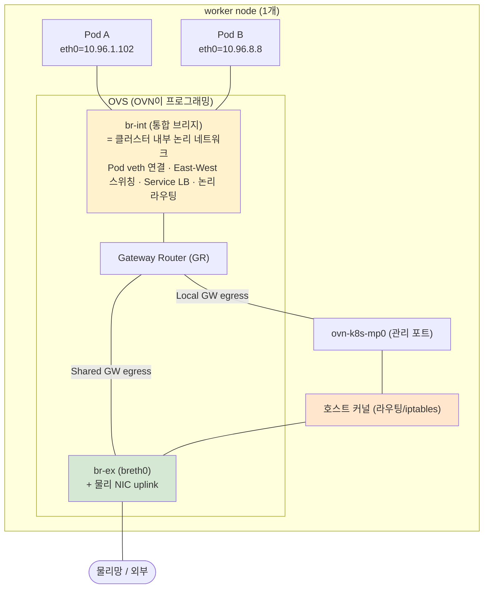

# 심화 01 - `br-int` 의미와 Shared Gateway 다중 NIC egress 동작 (Q1, Q2)

## 변경이력 (Change History)

| 버전 | 일자 | 작성자 | 작성/검증 | 변경 내용 |
|------|------------|-------------|-----------|-----------|
| v1.0 | 2026-09-11 | k.s.k & kiro | 1차 생성 + 자체 교차검증 + 링크 검증 | Q1(br-int 정의), Q2(다중 NIC egress / hostNetwork / NAS NIC) 상세 설명 최초 작성 |

> 개념 근거는 [`../references/01-ovn-gateway-concepts.md`](../references/01-ovn-gateway-concepts.md), 출처는 [`../references/03-glossary-and-sources.md`](../references/03-glossary-and-sources.md) 참조.

---

## Q1. `br-int` 는 클러스터 내 OVN이 관리하는 internal bridge network인가?

**네, 맞습니다.** `br-int`(integration bridge, 통합 브리지)는 **각 노드에 존재하는 OVS 브리지**로, OVN-Kubernetes가 프로그래밍하는 **클러스터 내부 논리 네트워크의 데이터플레인 중심**입니다. `scenario-3` 구성도의 `br-int / GR(OVN)` 표기가 이것을 의미합니다.

### 노드 내 주요 OVS/OVN 구성요소

| 구성요소 | 역할 |
|----------|------|
| **`br-int`** | 통합 브리지. 모든 Pod의 veth(예: Pod의 `eth0` 반대편)가 여기에 연결됨. OVN 논리 스위치/라우터가 여기에 OpenFlow로 구현됨. **East-West 스위칭, 서비스 로드밸런싱(OVN LB), 논리 라우팅**이 모두 여기서 일어남. |
| **`br-ex` (breth0)** | 외부 브리지. 노드의 물리 NIC를 uplink로 편입. 노드 물리 IP/MAC이 커널과 OVN 간 공유됨. **north-south egress/ingress의 물리망 접점.** |
| **Gateway Router (GR)** | OVN 논리 라우터. `br-int`(내부)와 `br-ex`(외부)를 patch port로 연결. egress SNAT 처리 지점. |
| **`ovn-k8s-mp0`** | 관리 포트. 호스트 커널 ↔ OVN 간 통로. Local GW의 egress 경로이자, 노드↔Pod 통신 경로. |

- 근거: OVN-Kubernetes는 각 노드에서 OVS를 실행하며, OVN이 각 노드의 OVS를 프로그래밍하여 선언된 네트워크 구성을 구현함. 원문 내용을 재구성함. [Red Hat: OVN-Kubernetes network plugin](https://docs.redhat.com/en/documentation/openshift_container_platform/4.18/observability/ovn-kubernetes_network_plugin/configuring-secondary-external-gateway)
- 근거: 외부 브리지(breth0)는 노드 셋업 시 물리 NIC를 uplink로 편입하고, 노드 물리 IP/MAC이 커널과 OVN 간 공유됨. GR의 외부 포트는 breth0와 동일 MAC 사용. Shared는 OVS 데이터패스에 머무름, Local은 관리 포트로 호스트 커널로 나감. 원문 내용을 재구성함. [OVN-Kubernetes: bridge-flows](https://ovn-kubernetes.io/master/design/bridge-flows/)

> Content was rephrased for compliance with licensing restrictions.

### 개념 위치도

> 정리: `br-int` = "클러스터 내부에서 OVN이 관리하는 internal bridge network"가 맞습니다. `br-ex`는 그 트래픽이 외부 물리망으로 나가는 접점이고, GR이 둘을 잇는 논리 라우터입니다.

---

## Q2. Shared Gateway + 노드에 NIC 2개(service NIC + NAS NIC). Pod가 hostNetwork 없이 NAS NIC로 통신 가능한가?

### 결론 먼저

**기본적으로는 불가능합니다.** OVN-Kubernetes 기본(primary) 네트워크의 Pod egress는 **`br-ex`로 편입된 "하나의" 인터페이스(= 노드의 기본 경로 NIC)** 를 통해서만 나갑니다. Pod가 목적지 IP만 보고 "OVN이 알아서 NAS 전용 NIC를 골라서" 내보내 주지는 **않습니다.** 즉 기대하신 "OVN이 필요한 NIC를 자동 선택 + SNAT" 동작은 **기본 네트워크에서는 제공되지 않습니다.**

### 왜 그런가 — 핵심 메커니즘 3가지

**(1) 기본 네트워크는 "단일 primary 인터페이스"만 사용**

OVN-Kubernetes에서 Pod는 하나의 primary 네트워크를 가지며, **기본적으로 모든 트래픽이 primary 네트워크를 통과**합니다. 다른 네트워크로 보내려면 **명시적으로 Pod 라우트/보조 네트워크를 구성**해야 합니다.

- 근거: primary 네트워크는 Pod의 주 네트워크로 동작하고, Pod 라우트를 구성하지 않는 한 기본적으로 모든 트래픽이 primary 네트워크를 통과함. 보조(secondary) 네트워크는 명시적으로 구성한 Pod 트래픽만 해당 인터페이스로 라우팅됨. 원문 내용을 재구성함. [Red Hat OCP 4.20: Understanding multiple networks](https://docs.redhat.com/en/documentation/openshift_container_platform/4.20/html-single/multiple_networks/)

**(2) `br-ex`는 "노드 기본 경로(default route) NIC" 하나로 만들어짐**

노드 셋업 시 OVS 브리지 `br-ex`(breth0)에는 **기본 경로를 가진 주 NIC 하나**가 uplink로 편입되고, 그 NIC의 IP/route가 브리지로 이관됩니다. 따라서 Pod egress(Shared GW에서 OVS가 직접 내보내는 트래픽)는 이 `br-ex` = 주 NIC 경로를 따릅니다. NAS 전용 NIC는 이 데이터플레인에 편입되어 있지 않으므로 OVN이 그쪽으로 Pod 트래픽을 자동 분기하지 않습니다.

- 근거: gateway 모드 변경으로 호스트의 기본 NIC가 OVS 브리지 `br-ex`에 편입됨. 원문 내용을 재구성함. [Red Hat CNV-10590](https://redhat.atlassian.net/browse/CNV-10590)
- 근거: Shared GW에서 egress 트래픽은 OVS가 노드 IP 인터페이스로 직접 출력함(호스트 라우팅 미경유). 원문 내용을 재구성함. [OKD: Configuring a gateway](https://docs.okd.io/4.19/networking/ovn_kubernetes_network_provider/configuring-gateway.html)

**(3) `hostNetwork: true`는 "Pod가 노드 커널 네트워크를 그대로 사용"하게 함**

`hostNetwork: true` Pod는 OVN Pod 네트워크(br-int veth)가 아니라 **노드의 네트워크 네임스페이스**를 직접 사용합니다. 따라서 Pod가 곧 호스트이며, **노드의 라우팅 테이블/여러 NIC/정책 라우팅을 그대로** 활용할 수 있어 NAS NIC로도 목적지에 맞춰 나갈 수 있습니다. 이것이 "hostNetwork를 켜니 NAS 통신이 되더라"의 이유입니다. 단, Pod IP = 노드 IP가 되고 포트 충돌·격리 약화 등 부작용이 있습니다.

### 그래서 기대 동작("hostNetwork 없이 자동 NIC 선택")을 원하면?

기본 네트워크만으로는 안 되고, 다음 중 하나가 필요합니다. (모두 "명시적 구성"이 전제)

| 방식 | 요약 | 비고 |
|------|------|------|
| **Multus 보조 네트워크(NAD)** | NAS NIC를 macvlan/ipvlan/host-device 등으로 Pod에 **두 번째 인터페이스(net1)** 로 붙임 | Pod가 NAS 트래픽을 net1로 명시적으로 사용. 애플리케이션이 인터페이스/경로 인지 필요할 수 있음 |
| **Egress Router Pod** | 별도 egress router pod가 net1(보조 네트워크)로 나가고, 클라이언트 pod는 그 서비스로 접근 | 사설 소스 IP로 특정 원격 서버 접근. 모든 연결용은 아님(HW MAC 한계). 근거 아래 |
| **hostNetwork: true** | Pod가 노드 netns 직접 사용 → 노드의 멀티 NIC/라우팅 그대로 | 가장 단순하나 격리 약화·포트충돌. 질문3에서 부작용 발생 |
| **EgressIP + 정책 라우팅** | egress 소스 IP 고정 및 특정 노드/인터페이스로 유도 | 사용자가 원치 않는 방식(질문3) |

- 근거(egress router): egress router pod는 두 개의 인터페이스(eth0=클러스터망, net1=보조망)를 가지며, net1로 외부에 나가고 다른 pod는 egress router 서비스를 통해 외부에 접근. 모든 아웃바운드 연결용은 아님. 원문 내용을 재구성함. [OKD: Considerations for the use of an egress router pod](https://docs.okd.io/4.21/networking/ovn_kubernetes_network_provider/using-an-egress-router-ovn.html)

> Content was rephrased for compliance with licensing restrictions.

### "0.0.0.0:30001 listen"에 대한 오해 정리

- Pod가 `0.0.0.0:30001`을 listen 하는 것은 **인바운드(수신)** 소켓 바인딩입니다. 이것은 "어느 NIC로 나갈지(아웃바운드 라우팅)"와는 **별개**입니다.
- 아웃바운드(다른 service/pod/외부 서버 호출) 시 어느 NIC로 나갈지는 **Pod netns의 라우팅 테이블**이 결정합니다. 기본 네트워크 Pod의 netns에는 사실상 OVN이 넣어준 기본 경로(→ br-int → GR → br-ex = 주 NIC) 하나가 있으므로, **NAS NIC로 자동 분기되지 않습니다.**
- 반면 `hostNetwork: true`이면 Pod netns = 노드 netns 이므로 노드의 다중 NIC/정책 라우팅이 그대로 적용되어 NAS NIC 사용이 가능해집니다.

> 요약(Q2): "OVN이 목적지 IP만 보고 알아서 NAS NIC를 골라 SNAT" 하는 동작은 **기본 네트워크에서 제공되지 않습니다.** NAS 전용 NIC로 Pod가 통신하려면 (a) Multus 보조 네트워크로 net1을 붙이거나, (b) egress router pod를 두거나, (c) hostNetwork를 쓰거나, (d) EgressIP/정책 라우팅을 구성해야 합니다. 이 중 (c)hostNetwork가 가장 간단하지만 질문3의 부작용(동시에 pod-네트워크 통신이 필요한 워크로드에서 충돌)을 유발합니다 — 상세는 [`02-ipforwarding-global-egress.md`](02-ipforwarding-global-egress.md) 참조.
