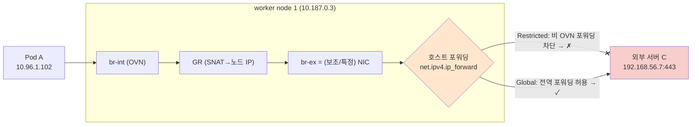

# 심화 02 - hostNetwork 딜레마와 `ipForwarding: Global` 변경 효과 (Q3)

## 변경이력 (Change History)

| 버전 | 일자 | 작성자 | 작성/검증 | 변경 내용 |
|------|------------|-------------|-----------|-----------|
| v1.0 | 2026-09-11 | k.s.k & kiro | 1차 생성 + 자체 교차검증 + 링크 검증 | Q3(F5-CIS 연동, hostNetwork 충돌, ipForwarding Global 변경 효과) 상세 분석 최초 작성 |

> 개념 근거는 [`../references/01-ovn-gateway-concepts.md`](../references/01-ovn-gateway-concepts.md), 다중 NIC/hostNetwork 배경은 [`01-brint-and-multinic-egress.md`](01-brint-and-multinic-egress.md), 출처는 [`../references/03-glossary-and-sources.md`](../references/03-glossary-and-sources.md) 참조.

---

## 0. 먼저: 이 문서의 결론 요약

- **질문:** `routingViaHost: false, ipForwarding: Restricted` → `ipForwarding: Global` 로만 바꾸면 성공했을까?
- **정직한 답:** **"상황(=egress 트래픽이 노드의 어느 인터페이스/경로를 타야 하느냐)에 따라 다릅니다."**
  - 증상이 **"br-ex가 (기본 NIC가 아닌) 보조 인터페이스로 구성되어, 노드가 그 인터페이스로 트래픽을 포워딩해야 하는데 Restricted라 막혀 있었다"** 라면 → **Global 변경으로 해결될 가능성이 높습니다.** (아래 §2)
  - 증상이 **"Pod가 애초에 NAS/특정 NIC 경로 자체를 갖고 있지 않다(라우팅/인터페이스 부재)"** 라면 → **Global만으로는 해결되지 않습니다.** 이 경우는 경로/인터페이스 문제이지 포워딩 on/off 문제가 아니기 때문입니다. (아래 §3)
- 따라서 **바로 프로덕션에 반영하기 전에, 아래 §4의 tcpdump 절차로 "패킷이 어디서 멈추는지"를 먼저 확인**해야 확정할 수 있습니다.

> `ipForwarding`는 하드코딩된 "된다/안된다" 스위치가 아니라 **"노드가 OVN-Kubernetes 관리 인터페이스(br-ex 등)에서 비 OVN 트래픽을 포워딩(라우팅)해 줄지"** 를 켜고 끄는 값입니다. 그래서 "노드가 라우터 역할을 해야 하는 토폴로지"에서만 결과가 바뀝니다.

---

## 1. 현재 겪은 현상 정리 (질문 3)

| 관측 | 내용 |
|------|------|
| 설정 | `routingViaHost: false`(Shared GW), `ipForwarding: Restricted` |
| 정상 | 외부 → Pod (ingress, F5-CIS clusterIP mode 경유) 는 잘 됨 |
| 오류 | Pod → 외부 서버 (scenario-3 egress) 가 실패 |
| 임시조치 | 해당 Pod에 `spec.hostNetwork: true` 설정 → egress 정상화 |
| 새 문제 | "외부 서버 호출 후 그 결과를 다른 Pod로 호출"하는 워크로드에서 **hostNetwork 값에 따라 둘 중 하나만 성공** |
| 원치 않는 대안 | NIC에 egress IP 추가 + OVN EgressIP 설정 |

이 현상은 다음 두 가지가 겹쳐 있습니다.

1. **egress 경로 문제:** 기본 Shared GW egress(br-ex=주 NIC)로는 외부 서버에 도달하지 못하는 라우팅/포워딩 구성. (그래서 hostNetwork로 노드 라우팅을 빌려 해결)
2. **hostNetwork 의 부작용:** hostNetwork를 켜면 Pod가 **노드 netns**를 쓰므로 외부(노드 라우팅 기반) 통신은 되지만, **클러스터 내부 Pod↔Pod(오버레이) 통신 특성이 달라져** "외부 호출 + 내부 Pod 호출"을 함께 하는 워크로드에서 한쪽이 깨짐.

---

## 2. `ipForwarding: Global` 이 해결하는 경우 (그리고 그 이유)

### 왜 Restricted에서 막혔나

`ipForwarding`의 정의는 **"OVN-Kubernetes 관리 인터페이스(예: `br-ex`)상의 모든 트래픽에 대한 IP 포워딩 제어"** 입니다. 기본값 **Restricted**에서는 **Kubernetes 관련 트래픽은 포워딩되지만, 그 외 IP 트래픽은 노드가 라우팅하지 않습니다.** 호스트가 OVN-Kubernetes 관리 인터페이스를 통해 (일반) 트래픽을 포워딩하도록 하려면 **Global** 로 설정합니다.

- 근거: IPForwarding은 br-ex 같은 OVN-Kubernetes 관리 인터페이스의 모든 트래픽에 대한 IP 포워딩을 제어. 기본 Restricted에서 Kubernetes 관련 트래픽은 적절히 포워딩되나 그 외 IP 트래픽은 OCP 노드가 라우팅하지 않음. 호스트가 관리 인터페이스로 포워딩하게 하려면 Global. 원문 내용을 재구성함. [Red Hat Solution 7053694](https://access.redhat.com/solutions/7053694)

> Content was rephrased for compliance with licensing restrictions.

### 실제로 이 KB(7053694)가 다루는 시나리오

Red Hat KB 7053694의 제목/내용 자체가 **"보조 인터페이스를 br-ex로 사용하는 노드에서 hostNetwork Pod가 기본 kubernetes service IP로 라우팅되지 못한다"** 입니다. 즉 **br-ex가 주 NIC가 아니라 별도(보조) 인터페이스로 구성**된 환경에서, 노드가 그 인터페이스 상으로 트래픽을 포워딩해야 하는데 **Restricted가 이를 막아** 통신이 실패하고, **Global로 풀면 포워딩이 허용되어 정상화**됩니다.

- 여러분 환경이 **service 전용 NIC / NAS 전용 NIC 분리** 구성이고, egress가 노드에서 특정 인터페이스로 포워딩되어야 하는 상황이라면 이 KB의 케이스와 **구조적으로 동일**할 가능성이 큽니다.

### 그림으로 본 Global의 효과 (br-ex가 보조 NIC일 때)



> 이 경우 **Global 변경으로 hostNetwork 없이 egress가 정상화**될 수 있고, 그러면 §1의 새 문제(hostNetwork 부작용으로 내부 Pod 호출이 깨지던 것)도 **hostNetwork를 꺼도 되므로 함께 해소**됩니다. 이것이 여러분이 원하는 "EgressIP 안 쓰고 해결" 시나리오에 부합합니다.

### 구현 메커니즘 관점

- Restricted(기본)에서 OVN-Kubernetes는 포워딩 sysctl을 **자신의 관리 포트/브리지 인터페이스에만** 켭니다(전역 `net.ipv4.ip_forward`는 켜지 않음). Global로 두면 전역 포워딩이 활성화되어 노드가 일반 라우터처럼 인터페이스 간 트래픽을 포워딩합니다.
- 근거: IPv4 활성 시 관리 포트/브리지 인터페이스에만 `net.ipv4.conf.[IFNAME].forwarding=1` 설정(관리자가 전역 `net.ipv4.ip_forward`를 직접 켜지 않는 한). 원문 내용을 재구성함. [OVN-Kubernetes: Config Variables](https://raw.githubusercontent.com/ovn-kubernetes/ovn-kubernetes/master/docs/getting-started/configuration.md)

> Content was rephrased for compliance with licensing restrictions.

---

## 3. `ipForwarding: Global` 으로도 해결되지 **않는** 경우 (주의)

Global은 "노드가 포워딩(라우팅)을 해준다"는 것이지, **"없는 경로/인터페이스를 만들어 준다"는 것이 아닙니다.** 다음 경우엔 Global만으로 부족합니다.

1. **Pod가 외부 서버로 가는 경로 자체가 노드 라우팅 테이블에 없음:** 외부 서버 C가 NAS/별도 세그먼트에 있고 노드에 그 방향 경로(정적 경로/게이트웨이)가 없다면, 포워딩을 켜도 나갈 길이 없습니다. → 노드 라우팅(정적 경로) 또는 보조 네트워크 구성이 별도로 필요.
2. **비대칭 라우팅(asymmetric routing) / RPF drop:** egress는 특정 NIC로 나가는데 응답이 다른 NIC로 들어오거나, reverse path filter(`rp_filter`)에 걸려 드롭되는 경우. 이는 포워딩 on/off와 별개의 정책 라우팅 문제.
3. **F5 return path 문제:** F5 clusterIP mode에서 BIG-IP ↔ Pod 직접 라우팅(static route)을 쓰는 경우, 요청/응답 경로가 대칭이 되도록 노드/BIG-IP 양쪽 라우팅이 맞아야 함. 근거: F5 CIS는 노드 subnet 정적 경로로 BIG-IP↔Pod 직접 라우팅 구성. 원문 내용을 재구성함. [F5 clouddocs: Static Route Support](https://clouddocs.f5.com/containers/latest/userguide/static-route-support.html)
4. **애초에 NAS 전용 NIC로 "Pod 트래픽"을 보내려던 것이라면:** 이는 [`01-brint-and-multinic-egress.md`](01-brint-and-multinic-egress.md)에서 설명한 "기본 네트워크는 단일 primary 인터페이스" 제약이 근본 원인이며, 포워딩이 아니라 **보조 네트워크(Multus)/egress router** 문제입니다.

> Content was rephrased for compliance with licensing restrictions.

> 즉, **"br-ex가 (기본 NIC가 아닌) 특정/보조 인터페이스이고, 노드가 그 위로 egress를 포워딩만 해주면 되는 상황"** → Global로 해결. **"경로/인터페이스/대칭성 자체가 문제"** → Global 무관, 라우팅·보조네트워크 설계 필요.

---

## 4. 확정 진단 절차 (프로덕션 반영 전 필수)

`hostNetwork: false`(원래대로) 상태에서 아래 지점을 동시에 tcpdump 하여 **패킷이 어디서 사라지는지** 확인하면, Global이 답인지 즉시 판별됩니다.

```bash
# (A) Pod netns 에서 egress 진입 확인
oc rsh <pod> ; # 컨테이너에 tcpdump 없으면 아래 nsenter 사용
#   기대: src 10.96.1.102 → dst 192.168.56.7:443 SYN 송신

# (B) 노드의 br-ex (또는 br-ex로 편입된 실제 인터페이스)
tcpdump -ni br-ex host 192.168.56.7 and tcp port 443
#   기대(정상): src 10.187.0.3(노드IP, SNAT후) → dst 192.168.56.7:443 SYN

# (C) NAS/특정 세그먼트로 나가야 한다면 그 물리 NIC
tcpdump -ni <nas_nic> host 192.168.56.7 and tcp port 443

# (D) 외부 서버 C 에서 수신 확인
tcpdump -ni <if> host 10.187.0.3 and tcp port 443
```

판정 가이드:

| 관측 결과 | 해석 | 조치 |
|-----------|------|------|
| (A)엔 보이는데 (B) 노드 egress 인터페이스에서 SYN이 안 나감 | 노드가 포워딩을 막고 있음(Restricted) | **`ipForwarding: Global`로 해결 가능성 높음** |
| (B)엔 나가는데 (D) 외부서버 미수신 / (D) SYN엔 오나 SYN-ACK 반송 실패 | 경로/대칭성(return path)·방화벽 문제 | 라우팅/정적경로/방화벽 점검 (Global 무관) |
| (A)에서 아예 다른 NIC 방향으로 안 잡힘 / 경로 없음 | Pod netns에 해당 경로 부재 | 보조 네트워크(Multus)/노드 정적경로 필요 (Global 무관) |

---

## 5. `hostNetwork` 딜레마(§1의 새 문제)에 대한 근본 정리

- `hostNetwork: true` → Pod가 **노드 netns** 사용: 외부(노드 라우팅) 통신엔 유리하나, 클러스터 오버레이 기반의 Pod↔Pod/Service 통신 관점에서 소스 IP·경로가 달라져 특정 워크로드가 깨질 수 있음.
- `hostNetwork: false` → **OVN Pod 네트워크** 사용: 내부 Pod↔Pod는 자연스러우나, 위처럼 egress가 노드의 특정 NIC 포워딩을 필요로 하면 Restricted에서 막힘.
- **한 Pod가 "외부 호출 + 내부 Pod 호출"을 모두 해야 한다면**, hostNetwork on/off 어느 쪽으로도 한 번에 만족하기 어려운 것이 정상입니다. 그래서:
  - **선호 해법:** `hostNetwork: false` 유지 + **`ipForwarding: Global`** 로 egress 포워딩 문제만 해제 → 내부 Pod 통신(오버레이)과 외부 egress를 **동시에** 만족 (단 §4로 검증, §3 예외 아닐 것).
  - EgressIP를 원치 않으신다는 전제에서, Global은 "노드를 라우터로 쓰는" 정공법에 해당합니다. 다만 Global은 **노드 전체의 포워딩을 여는** 설정이므로, 보안 관점(노드가 원치 않는 트래픽까지 포워딩)에서 방화벽/NetworkPolicy로 범위를 함께 관리하는 것을 권장합니다.

---

## 6. 권고 (요약)

1. **먼저 진단(§4):** `hostNetwork: false`로 되돌린 뒤, egress SYN이 **노드 egress 인터페이스에서 안 나가는지** 확인.
2. **안 나가면(포워딩 차단이 원인):** `routingViaHost: false` 유지 + **`ipForwarding: Global`** 적용 → hostNetwork 없이 egress 정상화 기대. 이 경우 §1의 "hostNetwork 때문에 내부 Pod 호출이 깨지던" 문제도 해소.
3. **나가는데 외부 미도달이면(경로/대칭성 원인):** Global 무관. 노드/BIG-IP 라우팅(정적 경로), 방화벽, RPF를 점검. F5 static-route 구성 대칭성 확인.
4. **NAS 전용 NIC로 "Pod 트래픽"을 보내려는 의도라면:** Multus 보조 네트워크 또는 egress router 설계가 정공법(포워딩 문제 아님).
5. Global은 노드 전체 포워딩을 여므로 **적용 후 보안 경계(방화벽/NetworkPolicy)를 함께 검토**하십시오.

> Content was rephrased for compliance with licensing restrictions.
