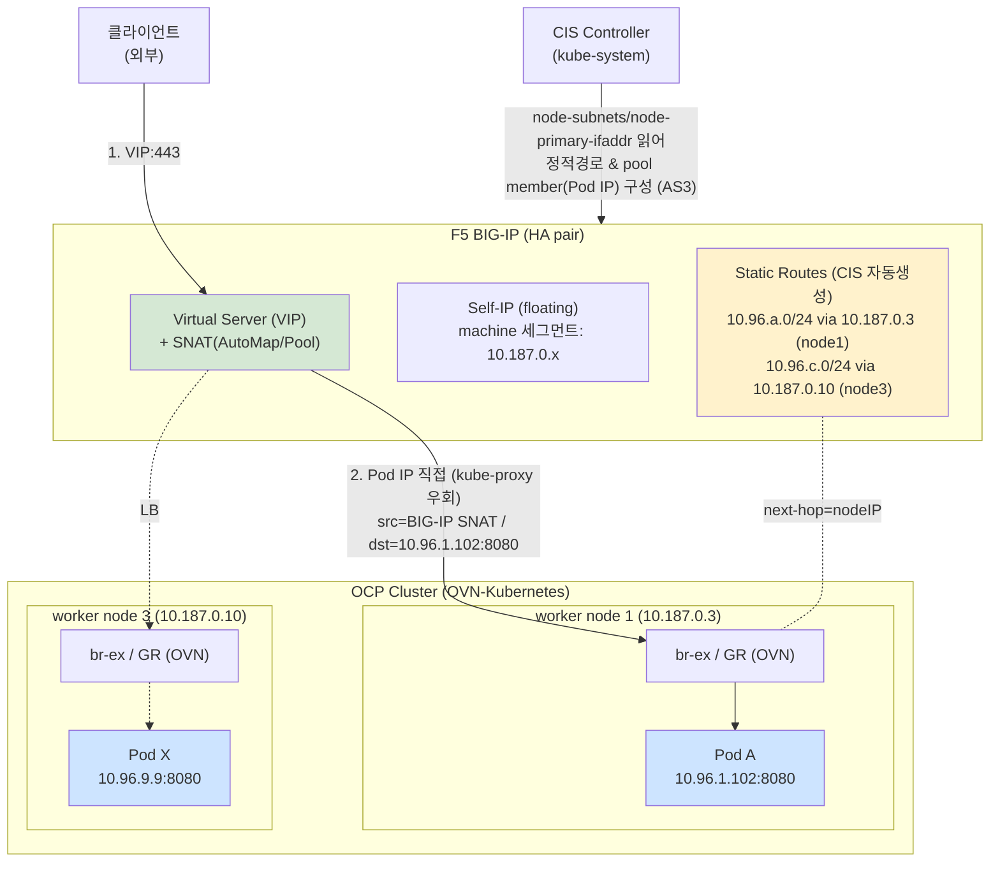

# F5 CIS (ClusterIP mode) ↔ OCP Cluster 연동 아키텍처 (Network 관점)

## 변경이력 (Change History)

| 버전 | 일자 | 작성자 | 작성/검증 | 변경 내용 |
|------|------------|-------------|-----------|-----------|
| v1.0 | 2026-09-11 | k.s.k & kiro | 1차 생성 + 자체 교차검증 + 링크 검증 | F5 CIS ClusterIP mode + OVN-Kubernetes(static route, no-tunnel) 아키텍처 및 네트워크 설정, ipForwarding/routingViaHost 관계 최초 작성 |
| v1.1 | 2026-09-11 | k.s.k & kiro | Multus 섹션 추가 | 5-A절 추가: Multus 보조 네트워크(net1) 환경에서 ClusterIP mode 처리(ingress=eth0 Pod IP, egress=net1), 패킷 요약, ipForwarding 무관 대안 |
| v1.2 | 2026-09-11 | k.s.k & kiro | NodePort listen 섹션 추가 | 5-B절 추가: hostNetwork 없이 listen(0.0.0.0,30000) 오해 교정(targetPort listen + kube-proxy DNAT), routingViaHost:false + ipForwarding false/true 기준 NodePort 수신 설명 |

> 개념 근거는 [`../references/01-ovn-gateway-concepts.md`](../references/01-ovn-gateway-concepts.md), egress/ipForwarding 심화는 [`../deep-dive/02-ipforwarding-global-egress.md`](../deep-dive/02-ipforwarding-global-egress.md), 출처는 [`../references/03-glossary-and-sources.md`](../references/03-glossary-and-sources.md) 참조.

---

## 0. 한눈에 보는 결론

- **F5 CIS ClusterIP mode = "BIG-IP 풀 멤버로 Pod IP를 직접 등록"** 하는 방식. kube-proxy를 우회하고 BIG-IP가 Pod로 직접 로드밸런싱합니다. 전제: **BIG-IP가 Pod IP로 라우팅 가능해야 함.**
- OVN-Kubernetes 환경에서 Pod 라우팅 도달 방법은 3가지: (a) 오버레이 터널(VXLAN, 구형/제약), (b) **Static Routing Mode(터널 없음, 권장)**, (c) BGP/Public cloud 라우팅.
- **Static Routing Mode(no-tunnel)**: CIS가 각 노드의 podCIDR/nodeIP 어노테이션을 읽어 **BIG-IP에 정적 경로를 자동 생성**(next-hop = 노드 IP). BIG-IP는 `podCIDR via nodeIP` 로 Pod에 직접 도달.
- 이때 **routingViaHost / ipForwarding** 는 주로 **ingress return path**(Pod→BIG-IP 응답)와 **Pod egress(→ 외부)** 경로 성립에 영향을 줍니다. 특히 **노드가 여러 NIC를 가지거나 BIG-IP가 별도 세그먼트일 때 `ipForwarding: Global`이 필요할 수 있음.**

---

## 1. CIS Pool Member Type (네트워크 모드) 개요

BIG-IP가 트래픽을 백엔드로 보내는 방식은 CIS 배포의 `pool-member-type` 로 결정됩니다.

| 모드 | 풀 멤버 | kube-proxy | Pod 직접 라우팅 필요 | 요약 |
|------|---------|:----------:|:--------------------:|------|
| **NodePort** | 노드 IP:NodePort | 사용(추가 홉) | 불필요 | SDN 무관, 어디서나 동작. kube-proxy 2차 LB 홉 존재 |
| **ClusterIP** (cluster mode) | **Pod IP** | 우회 | **필요** | BIG-IP→Pod 직접. 오버레이/Static Route/BGP 등으로 Pod 도달 |
| NodePortLocal | Pod (Antrea NPL 매핑) | 우회 | Antrea 한정 | Antrea 전용 |
| Auto | service type에 따라 Pod/노드 IP 혼합 | 혼합 | 부분 | ClusterIP면 Pod IP, NodePort면 노드 IP. hostNetwork Pod는 노드로 직접 |

- 근거: ClusterIP mode는 Pod로 직접 라우팅할 수 있어야 하며(Flannel/OpenShift VXLAN 오버레이, 또는 Calico BGP·Public cloud·Static Routing Mode 등 Pod-routable 네트워크), ingress가 kube-proxy를 우회해 Pod로 직접 감. NodePort는 SDN 요구가 없고 kube-proxy가 백엔드 Pod를 추적하나 LB 홉이 추가됨. 원문 내용을 재구성함. [F5 clouddocs: BIG IP Networking with CIS](https://clouddocs.f5.com/containers/latest/userguide/config-options.html)
- 근거: ClusterIP mode는 kube-proxy 우회로 Pod에 직접 트래픽을 보내지만, Pod가 자주 스케일 인/아웃되면 CIS가 AS3 REST-API로 BIG-IP를 구성하는 특성상 이슈가 있을 수 있음. 원문 내용을 재구성함. [F5 Community: CIS and k8s traffic policies to pods](https://community.f5.com/kb/communityarticles/f5-container-ingress-services-cis-and-using-k8s-traffic-policies-to-send-traffic/344846)

> Content was rephrased for compliance with licensing restrictions.

---

## 2. OVN-Kubernetes + ClusterIP mode의 Pod 도달 방법 (Network)

### 2.1 (권장) Static Routing Mode — 터널 없음

CIS가 노드 어노테이션에서 podCIDR·nodeIP를 읽어 **BIG-IP에 정적 경로를 동적으로 생성/관리**합니다. VXLAN 터널이나 Calico 없이 BIG-IP↔Pod 직접 라우팅이 됩니다.

CIS 배포 인자:

```yaml
args:
  - --static-routing-mode=true
  - --orchestration-cni=ovn-k8s
  # 노드에 NIC가 여러 개면 어떤 노드망에서 nodeIP를 고를지 지정
  - --static-route-node-cidr=10.187.0.0/24   # (본 분석 환경의 machine pool 예시)
  # 선택: /Common 파티션에 공유 정적경로 생성
  # - --shared-static-routes=true
```

CIS가 읽는 OVN-Kubernetes 노드 어노테이션:

| 어노테이션 | 의미 |
|------------|------|
| `k8s.ovn.org/node-subnets` | 노드에 할당된 **podCIDR** (BIG-IP 정적경로의 목적지) |
| `k8s.ovn.org/node-primary-ifaddr` | 노드 **primary NIC IP** (정적경로의 next-hop = nodeIP). `--static-route-node-cidr` 미설정 시 기본 사용 |
| `k8s.ovn.org/host-addresses` | `--static-route-node-cidr` 설정 시 노드 IP 선택에 사용(멀티 NIC) |

BIG-IP에 생성되는 정적 경로: 이름 형식 `k8s-<nodename>-<nodeip>`, 내용은 **`podCIDR via nodeIP`**.

- 근거: `--static-routing-mode=true` + `--orchestration-cni=ovn-k8s` 로 BIG-IP에 노드 subnet 정적 경로를 만들어 터널 없이 Pod로 직접 라우팅. 멀티 인터페이스 노드는 `--static-route-node-cidr`로 nodeIP를 고를 노드망 지정(미설정 시 `k8s.ovn.org/node-primary-ifaddr` 사용). 경로명 `k8s-<nodename>-<nodeip>`. 원문 내용을 재구성함. [F5 clouddocs: StaticRouteSupport](https://clouddocs.f5.com/containers/latest/userguide/static-route-support.html)

> Content was rephrased for compliance with licensing restrictions.

### 2.2 (참고) 오버레이/기타

- OVN-Kubernetes hybrid overlay(iCNIv1, VXLAN)는 **OpenShift 4.13+ 에서 제거**되어, OVN-Kubernetes에서는 **Static Routing Mode(no-tunnel)** 가 사실상 표준입니다. 원문 내용을 재구성함. [F5 clouddocs: OpenShift 4.8 & CIS OVN-Kubernetes](https://clouddocs.f5.com/containers/latest/userguide/openshift/openshift-4-8-cluster.html)
- BGP(Calico) / Public cloud 라우팅도 Pod-routable 방법으로 사용 가능. [F5 clouddocs: config-options](https://clouddocs.f5.com/containers/latest/userguide/config-options.html)

> Content was rephrased for compliance with licensing restrictions.

---

## 3. 아키텍처 구성도 (HA BIG-IP + OVN-K, Static Route, no-tunnel)



### 트래픽 방향별 요약

| 방향 | 경로 | 소스/타겟 IP |
|------|------|--------------|
| **Ingress(외부→Pod)** | client → VIP → (정적경로 `podCIDR via nodeIP`) → 노드 br-ex → br-int → Pod | BIG-IP SNAT 시: src=BIG-IP self-IP, dst=Pod IP:8080 |
| **Return(Pod→BIG-IP)** | Pod → br-int → GR → (라우팅) → BIG-IP | src=Pod IP, dst=BIG-IP self-IP (SNAT 사용 시 대칭 보장) |
| **Pod egress(→외부)** | Pod → GR(SNAT→노드 IP) → br-ex → 외부 | src=노드 IP, dst=외부 |

---

## 4. Network 설정 정보 (OVN 측 + F5 측)

### 4.1 OVN-Kubernetes 측 (`gatewayConfig`)

```yaml
apiVersion: operator.openshift.io/v1
kind: Network
metadata:
  name: cluster
spec:
  defaultNetwork:
    type: OVNKubernetes
    ovnKubernetesConfig:
      gatewayConfig:
        routingViaHost: false      # Shared GW (기본)  ※ 아래 4.3 논의 참조
        ipForwarding: Restricted   # 기본. 멀티 NIC/별도 세그먼트면 Global 검토
```

- **routingViaHost:**
  - `false`(Shared): egress가 OVS(br-ex)에서 직접. 호스트 라우팅 미경유. 성능/offload 이점.
  - `true`(Local): egress가 호스트 커널(라우팅/iptables) 경유. **호스트의 정책 라우팅/멀티 NIC/방화벽을 egress에 적용**하고 싶을 때.
- **ipForwarding:**
  - `Restricted`(기본): k8s 관련 트래픽만 포워딩. 표준 단일 NIC 구성에서 충분.
  - `Global`: 노드가 일반 라우터처럼 **OVN 관리 인터페이스(br-ex 등) 상 모든 트래픽 포워딩**. 노드가 BIG-IP↔Pod 또는 보조 NIC 사이 중계 라우터 역할을 해야 할 때.

### 4.2 F5 CIS/BIG-IP 측 핵심 설정

| 항목 | 설정 | 비고 |
|------|------|------|
| `pool-member-type` | `cluster` | Pod IP를 풀 멤버로 (ClusterIP mode) |
| `--static-routing-mode` | `true` | BIG-IP 정적경로 자동생성 |
| `--orchestration-cni` | `ovn-k8s` | 노드 어노테이션 파싱 방식 결정 |
| `--static-route-node-cidr` | 예 `10.187.0.0/24` | 멀티 NIC 노드에서 next-hop nodeIP 선택 |
| BIG-IP Self-IP | machine 세그먼트(`10.187.0.0/24`)에 도달 가능한 self-IP | 정적경로 next-hop과 동일 L2/라우팅 도달 |
| BIG-IP Static Route | `podCIDR via nodeIP` (CIS 자동) | 예: `10.96.1.0/24 via 10.187.0.3` |
| VIP SNAT | **AutoMap 또는 SNAT Pool 권장** | return path 대칭 보장 (아래 4.3) |

### 4.3 SNAT와 return path — routingViaHost/ipForwarding의 실제 영향

BIG-IP LTM 일반 원칙: **백엔드(Pod)의 default route가 BIG-IP를 향하지 않으면, VIP에 SNAT(AutoMap/Pool)를 걸어 소스 IP를 BIG-IP self-IP로 바꿔야** Pod의 응답이 BIG-IP로 되돌아옵니다(대칭 라우팅 보장).

- 근거: 서버의 default route가 BIG-IP를 경유하지 않으면 SNAT를 구성하여 클라이언트 소스 IP를 BIG-IP floating self로 바꿔 서버 응답이 BIG-IP로 돌아오게 함. 원문 내용을 재구성함. [F5 Community: LTM SNAT AutoMap](https://community.f5.com/discussions/technicalforum/f5-ltm-question-automap/326104)
- 근거: Pod egress가 외부로 나갈 때 CNI가 통상 Pod가 위치한 노드 IP로 SNAT함. 원문 내용을 재구성함. [F5 clouddocs: Enabling Egress Traffic Using SNAT](https://clouddocs.f5.com/service-proxy-use-cases/main/egress_snat.html)

> Content was rephrased for compliance with licensing restrictions.

OCP Pod의 default route는 BIG-IP가 아니라 OVN(→ GR)을 향하므로, **ClusterIP mode ingress에서는 VIP SNAT(AutoMap)를 사용하는 것이 안전**합니다. SNAT를 쓰면 Pod 응답의 목적지가 BIG-IP self-IP가 되어, 노드 egress가 그 self-IP로 되돌아가면 됩니다. 이때:

- **단일 NIC(machine pool = BIG-IP 도달망) + Shared GW + Restricted:** return/egress가 br-ex(주 NIC)로 나가고 BIG-IP도 그 망에 있으면 대개 문제 없음. (사용자 환경에서 ingress가 잘 됐던 이유)
- **멀티 NIC(service NIC / NAS NIC 분리) 또는 BIG-IP가 별도 세그먼트:** 노드가 특정 인터페이스로 포워딩해야 하는 상황이 되며, `ipForwarding: Restricted`가 이를 막아 **Pod egress/특정 경로 통신이 실패**할 수 있음 → `ipForwarding: Global` 검토 필요. (이는 [`../deep-dive/02-ipforwarding-global-egress.md`](../deep-dive/02-ipforwarding-global-egress.md) 및 [Red Hat Solution 7053694](https://access.redhat.com/solutions/7053694) 케이스와 동일 맥락)

---

## 5. ipForwarding / routingViaHost 조합별 F5 연동 관점 정리

| 조합 | Ingress(외부→Pod, ClusterIP) | Return/Pod egress | F5 연동 관점 권고 |
|------|------------------------------|-------------------|-------------------|
| Shared(false) + Restricted **(기본)** | O (정적경로 + Pod IP 풀) | 단일 NIC·동일망이면 O. 멀티 NIC/별도 세그먼트면 egress 막힐 수 있음 | 표준 단일망 구성에 적합. VIP SNAT(AutoMap) 필수 권장 |
| Shared(false) + **Global** | O | 노드가 br-ex 등에서 일반 포워딩 → 멀티 NIC/별도 세그먼트 egress 성립 가능 | **멀티 NIC/별도 세그먼트에서 hostNetwork·EgressIP 없이 해결하려는 경우 유력** (단 tcpdump 검증) |
| Local(true) + Restricted | O | egress가 호스트 커널 경유 → 호스트 정책 라우팅/멀티 NIC 활용 가능하나 비 OVN 포워딩은 제한 | 호스트 라우팅 제어가 필요하나 노드 일반 라우팅까진 원치 않을 때 |
| Local(true) + **Global** | O | 호스트 커널 경유 + 전역 포워딩 → 가장 유연(노드=라우터) | 복잡한 멀티 NIC/return path 제어가 필요할 때. 보안 경계 별도 관리 |

> ClusterIP mode의 **ingress(외부→Pod) 도달은 4개 조합 모두 성립**합니다(정적경로 + Pod IP 풀 멤버). 조합이 실제로 갈리는 지점은 **return path/Pod egress가 노드의 특정 인터페이스 포워딩을 필요로 하는 멀티 NIC/별도 세그먼트 환경**입니다.

---

## 5-A. Multus 보조 네트워크가 있을 때의 처리 (ClusterIP mode)

> Multus 자체의 개념/구성/패킷 분석은 [`../deep-dive/04-multus-secondary-network.md`](../deep-dive/04-multus-secondary-network.md) 참조. 여기서는 **F5 CIS(ClusterIP mode) 연동에 국한**해 정리합니다.

전제: Pod가 `eth0`(기본 OVN-K 네트워크) + `net1`(Multus macvlan, 예 NAS 세그먼트) 을 가짐. 목적: 외부→Pod ingress는 F5(ClusterIP mode), 특정 대역(S3/NAS)은 net1으로 egress.

### 처리 원리

- **BIG-IP 풀 멤버 = Pod의 어느 IP인가?** ClusterIP mode에서 CIS는 **기본 네트워크(eth0)의 Pod IP**(`k8s.ovn.org/...` 기반, `10.96.x`)를 풀 멤버로 등록합니다. **net1(macvlan)의 IP는 CIS가 자동 등록하지 않습니다.** 즉 **ingress(F5→Pod)는 여전히 eth0의 Pod IP로 들어옵니다.**
- **net1은 egress 전용 경로**로 동작: Pod가 S3 대역으로 보내는 트래픽만 net1로 나갑니다(Pod netns 라우팅). F5 ingress 트래픽과 **인터페이스가 분리**되어 서로 간섭하지 않습니다.
- 따라서 **"F5(ClusterIP)로 들어오는 요청 처리 + net1로 S3 저장"이 hostNetwork:false로 양립**합니다. 이는 앞서 [`../deep-dive/03-nasnic-egress-and-routable-podcidr.md`](../deep-dive/03-nasnic-egress-and-routable-podcidr.md)에서 "ipForwarding:Global 없이 NAS egress를 해결하는 정공법"으로 언급한 Multus 경로에 해당합니다.

### 패킷 요약

| 트래픽 | 인터페이스 | 소스/타겟 |
|--------|-----------|-----------|
| F5 → Pod (ingress, ClusterIP) | Pod `eth0` | src=BIG-IP SNAT self-IP → dst=Pod IP(`10.96.1.102`):8080 |
| Pod → S3 (egress, NAS) | Pod `net1`(macvlan) | src=net1 IP(예 `192.168.90.51`) → dst=S3:443 (노드 IP SNAT 아님) |
| Pod → 내부 service/pod | Pod `eth0` | src=Pod IP → dst=ClusterIP/PodIP |

### 권고 / 주의 (ClusterIP mode + Multus)

- CIS 풀 멤버는 eth0 Pod IP 유지. **net1 IP를 F5가 백엔드로 알 필요 없음**(ingress는 eth0 경로).
- **default route는 eth0(클러스터)에 그대로** 두고, NAD에는 **S3 대역만 route** 로 추가(§deep-dive 04 §2.1). default route를 net1으로 옮기면 F5 return(및 클러스터 통신)이 깨질 수 있음.
- 이 구성이면 `routingViaHost:false` + `ipForwarding:Restricted`(기본) **그대로 두고도** NAS egress가 성립합니다(egress가 OVN이 아니라 net1로 빠지므로 ipForwarding과 무관). → 앞서 논의한 "Global 변경" 대신 **Multus가 더 깔끔한 대안**이 될 수 있습니다.

---

## 5-B. `hostNetwork` 없이 `listen(0.0.0.0, 30000)` 으로 NodePort 수신이 되는가?

### 5-B.1 핵심 결론 (오해 교정)

**"Pod 애플리케이션이 `0.0.0.0:30000`을 listen하면 노드의 30000 포트로 들어온 패킷을 받는다"는 것은 오해입니다.**

- `hostNetwork: false` 인 Pod에서 `bind(0.0.0.0:30000)` 의 `0.0.0.0`은 **"노드의 모든 IP"가 아니라 "Pod 네트워크 네임스페이스(netns)의 모든 인터페이스"**, 즉 **Pod의 `eth0`(Pod IP)** 를 의미합니다. **노드의 service NIC(물리 NIC)에 바인딩되는 것이 아닙니다.**
- 즉 이렇게 해도 **노드의 30000 포트가 그 프로세스로 직접 열리지 않습니다.** 노드포트를 실제로 여는 주체는 **애플리케이션이 아니라 `kube-proxy`(NodePort Service)** 입니다.

### 5-B.2 그러면 어떻게 해야 하나 — 올바른 구성

NodePort로 외부(또는 F5)에서 Pod로 들어오게 하려면:

1. **애플리케이션은 그냥 자기 포트(예 8080)를 listen** 합니다. `listen(0.0.0.0, 8080)` 이면 충분합니다. (Pod netns의 eth0에 바인딩)
2. **NodePort Service를 만듭니다.** 그러면 kube-proxy가 **모든 노드의 30000 포트**(nodePort)를 열고, 들어온 패킷을 **DNAT하여 Pod의 `targetPort`(8080)** 로 전달합니다.

```yaml
apiVersion: v1
kind: Service
metadata:
  name: myapp-np
spec:
  type: NodePort
  selector: { app: myapp }
  ports:
    - port: 8080
      targetPort: 8080     # Pod 앱이 listen 하는 포트
      nodePort: 30000      # 노드에서 열리는 포트 (kube-proxy가 개방)
```

- 앱 코드: `listen(0.0.0.0, 8080)` → **`30000`을 listen할 필요 없음.** 노드의 30000은 kube-proxy가 담당.
- Pod spec: `hostNetwork` **불필요(false 유지)**, 단 `containerPort: 8080` 명시 권장.

### 5-B.3 언제 `listen(0.0.0.0, 30000)` + hostNetwork:true가 필요한가

**애플리케이션이 "노드의 물리 NIC 30000 포트"를 직접 잡아야만 하는 경우**(Service를 안 쓰고 앱이 노드 포트를 직접 소유)라면, 그때는 **`hostNetwork: true`** 가 필요합니다. 이 경우 Pod가 노드 netns를 쓰므로 `0.0.0.0:30000`이 **노드의 모든 NIC(service NIC 포함)** 에 바인딩됩니다.

| 원하는 것 | hostNetwork | 앱 listen | 노드 30000 개방 주체 |
|-----------|:-----------:|-----------|----------------------|
| **일반적 NodePort 수신(권장)** | **false** | `0.0.0.0:8080`(targetPort) | kube-proxy(NodePort Service) |
| 앱이 노드 포트를 직접 소유 | **true** | `0.0.0.0:30000` | 앱 자신(노드 netns) |

### 5-B.4 `routingViaHost:false` + `ipForwarding: false / true` 기준 설명 (ClusterIP mode)

> 참고: `ipForwarding`의 지원값은 `Restricted`/`Global`입니다. 질문의 "false/true"를 각각 **`Restricted`(=제한, 사실상 기본 off) / `Global`(=전역 on)** 로 대응해 설명합니다.

전제: `routingViaHost: false`(Shared GW), `hostNetwork: false`, 앱은 `targetPort`(8080) listen, NodePort Service(30000) 존재. 외부/F5가 `nodeIP:30000`으로 접속.

**ingress(외부/F5 → nodeIP:30000 → Pod) 경로:**

- 외부가 `nodeIP:30000` 으로 오면 → 노드에서 **kube-proxy가 DNAT**(dst를 Pod IP:8080으로) → OVN(br-int)로 Pod에 전달. 이 경로는 **노드가 자신에게 온 트래픽을 자신의 Pod로 DNAT**하는 것이라, **`ipForwarding`(Restricted/Global) 값과 무관하게 동작**합니다.
- 즉 **NodePort 수신 자체는 `ipForwarding: Restricted`(false)에서도, `Global`(true)에서도 O.**

| 항목 | `routingViaHost:false` + `ipForwarding:Restricted`(false) | `routingViaHost:false` + `ipForwarding:Global`(true) |
|------|-----------------------------------------------------------|------------------------------------------------------|
| NodePort ingress(외부→nodeIP:30000→Pod) | **O** (kube-proxy DNAT, 노드 로컬 처리) | **O** (동일) |
| 앱이 30000 listen 필요? | 아니오(targetPort 8080 listen) | 아니오(동일) |
| hostNetwork 필요? | 아니오 | 아니오 |
| `ipForwarding`의 영향 | **없음**(수신 DNAT는 k8s 트래픽) | **없음**(단, 노드가 "제3자 트래픽 라우터"로 쓰일 때만 Global이 의미) |
| 응답(return) | Pod→요청자, kube-proxy conntrack이 역-DNAT로 대칭 보장 | 동일 |

- 근거: `ipForwarding` 기본 Restricted에서도 **Kubernetes 관련 트래픽은 정상 포워딩**되며, 그 외 IP 트래픽만 노드가 라우팅하지 않음. NodePort DNAT/서비스 트래픽은 k8s 관련 트래픽. 원문 내용을 재구성함. [Red Hat Solution 7053694](https://access.redhat.com/solutions/7053694)
- 근거: ClusterIP 내부 접근 및 노드 로컬 서비스 처리에서 소스 IP/DNAT 동작(kube-proxy). 원문 내용을 재구성함. [Kubernetes: Using Source IP](https://kubernetes.io/docs/tutorials/services/source-ip/)

> Content was rephrased for compliance with licensing restrictions.

> 정리(ClusterIP mode): NodePort **수신**은 `ipForwarding` false/true 모두 O이고 hostNetwork도 불필요합니다. `ipForwarding:Global`이 실제로 의미를 갖는 것은 (이 수신 경로가 아니라) 앞서 5절에서 다룬 **Pod egress가 노드의 특정 인터페이스 포워딩을 필요로 하는 경우**입니다. 즉 "NodePort listen 문제"와 "ipForwarding 문제"는 별개입니다.

### 5-B.5 특정 NIC(service NIC)로만 받고 싶다면

- `hostNetwork:false` + NodePort Service는 기본적으로 **모든 노드/모든 노드 IP**에서 30000이 열립니다(특정 NIC 한정 아님). "service NIC로만" 제한하려면 노드 방화벽(nftables/firewalld)로 30000 인입을 service NIC에 한정하거나, F5가 **service NIC의 nodeIP** 로만 접속하도록 구성(F5→nodeIP는 service NIC 세그먼트)하면 실질적으로 service NIC 경유가 됩니다.
- ClusterIP mode(F5가 Pod IP로 직접)에서는 애초에 NodePort를 쓰지 않으므로, "NodePort를 service NIC로 받기"가 목적이면 **NodePort Service 방식 또는 F5 NodePort/NPL mode**를 검토하는 것이 자연스럽습니다([`02-f5-cis-nodeportlocal-antrea-architecture.md`](02-f5-cis-nodeportlocal-antrea-architecture.md) 참조).

---

## 6. 설계 체크리스트 (Network)

1. **CIS 모드:** `pool-member-type: cluster` + `--static-routing-mode=true` + `--orchestration-cni=ovn-k8s`.
2. **멀티 NIC 노드:** `--static-route-node-cidr` 로 BIG-IP 도달 가능한 노드망(nodeIP) 명시. (미설정 시 primary-ifaddr 사용)
3. **BIG-IP 라우팅:** self-IP가 nodeIP 세그먼트(`10.187.0.0/24`)에 L2/L3 도달 가능. CIS 자동 정적경로(`podCIDR via nodeIP`) 확인.
4. **SNAT:** VIP에 AutoMap(또는 SNAT Pool) 적용 → Pod default route가 BIG-IP를 향하지 않아도 return 대칭 보장.
5. **egress/멀티 세그먼트:** Pod가 외부/다른 세그먼트로 나가야 하면, 단일 NIC가 아닌 경우 `ipForwarding: Global` 필요성 tcpdump로 검증([deep-dive 02](../deep-dive/02-ipforwarding-global-egress.md) §4 절차).
6. **HA:** BIG-IP HA(active/standby)와 CIS 다중 인스턴스 구성 시 CNI/구성이 HA 페어와 상호작용하는 방식 확인. 근거: [F5 clouddocs: Deploying CIS with BIG-IP HA](https://clouddocs.f5.com/containers/latest/userguide/cis-deployment-options.html)
7. **버전:** OVN-Kubernetes에서는 no-tunnel(static route)이 권장(iCNIv1/VXLAN은 4.13+ 제거). CIS 검증 버전(문서상 OCP 4.18 검증) 및 CIS 버전 요구사항 확인.

---

## 7. 출처 (링크 검증 완료)

| 출처 | 링크 | 상태 |
|------|------|------|
| F5 clouddocs: BIG IP Networking with CIS (모드) | https://clouddocs.f5.com/containers/latest/userguide/config-options.html | 200 OK |
| F5 clouddocs: StaticRouteSupport | https://clouddocs.f5.com/containers/latest/userguide/static-route-support.html | 200 OK |
| F5 clouddocs: OVN-K + BIG-IP HA no Tunnels (4.12) | https://clouddocs.f5.com/containers/latest/userguide/openshift/openshift-4-12-cluster.html | 200 OK |
| F5 clouddocs: OVN-K + BIG-IP standalone no Tunnels | https://clouddocs.f5.com/containers/latest/userguide/openshift/openshift-4-12-standalone.html | 200 OK |
| F5 clouddocs: OpenShift 4.8 & CIS OVN-K | https://clouddocs.f5.com/containers/latest/userguide/openshift/openshift-4-8-cluster.html | 200 OK |
| F5 clouddocs: Deploying CIS with BIG-IP HA | https://clouddocs.f5.com/containers/latest/userguide/cis-deployment-options.html | 200 OK |
| F5 clouddocs: Enabling Egress Traffic Using SNAT | https://clouddocs.f5.com/service-proxy-use-cases/main/egress_snat.html | 200 OK |
| F5 Community: LTM SNAT AutoMap | https://community.f5.com/discussions/technicalforum/f5-ltm-question-automap/326104 | 페이지 유효(스크립트 GET 403: 봇차단) |
| F5 Community: CIS & k8s traffic policies to pods | https://community.f5.com/kb/communityarticles/f5-container-ingress-services-cis-and-using-k8s-traffic-policies-to-send-traffic/344846 | 페이지 유효(스크립트 GET 403: 봇차단) |
| Red Hat Solution 7053694 (ipForwarding Global) | https://access.redhat.com/solutions/7053694 | 200 OK |

> community.f5.com은 자동화 클라이언트에 403(봇 차단)이나 브라우저 정상 접근됩니다(끊어진 링크 아님).
