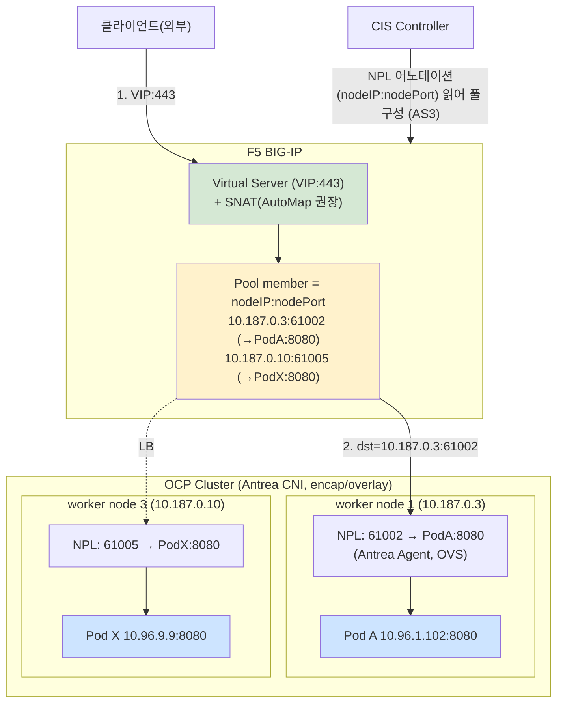

# F5 CIS (NodePortLocal mode) ↔ OCP Cluster (Antrea CNI) 상세 네트워크 구조

## 변경이력 (Change History)

| 버전 | 일자 | 작성자 | 작성/검증 | 변경 내용 |
|------|------------|-------------|-----------|-----------|
| v1.0 | 2026-09-11 | k.s.k & kiro | 1차 생성 + 자체 교차검증 + 링크 검증 | F5 CIS(NPL) + Antrea CNI 네트워크 구조, scenario1~3 CIS/Antrea 설정 권고, 동일 Pod 내부+NodePort+NAS S3 구성, overlay/underlay Pod CIDR 비교 최초 작성 |
| v1.1 | 2026-09-11 | k.s.k & kiro | Multus 섹션 추가 | 4-A절 추가: Multus 보조 네트워크(net1) 환경에서 NodePortLocal mode 처리(ingress=NPL nodeIP:nodePort→eth0, egress=net1), 패킷 요약 |
| v1.2 | 2026-09-11 | k.s.k & kiro | NodePort listen 섹션 추가 | 4-B절 추가: hostNetwork 없이 listen(0.0.0.0,30000) 오해 교정, NPL은 포트범위 자동할당(고정 30000 직접소유는 NodePort/hostNetwork 필요) |

> 개념 근거는 [`../references/01-ovn-gateway-concepts.md`](../references/01-ovn-gateway-concepts.md), F5 CIS(ClusterIP) 비교는 [`01-f5-cis-clusterip-ovn-architecture.md`](01-f5-cis-clusterip-ovn-architecture.md), NAS NIC egress/underlay 배경은 [`../deep-dive/03-nasnic-egress-and-routable-podcidr.md`](../deep-dive/03-nasnic-egress-and-routable-podcidr.md), 출처는 [`../references/03-glossary-and-sources.md`](../references/03-glossary-and-sources.md) 참조.

---

## ⚠️ 중요 전제 — CNI가 다릅니다

- 앞선 문서들(scenario 1~3, ClusterIP 연동)은 **OCP 기본 CNI = OVN-Kubernetes** 기준이며 `routingViaHost`/`ipForwarding`는 **OVN-Kubernetes 전용 파라미터**입니다.
- 본 문서는 **CNI를 Antrea로 교체**한 환경입니다. 따라서 **`routingViaHost`/`ipForwarding` 파라미터는 존재하지 않습니다.** Antrea의 대응 개념은 **`trafficEncapMode`(encap/noEncap/hybrid)** 와 **`noSNAT`**, **NodePortLocal(NPL)** 입니다.
- OpenShift에서 기본 지원 CNI는 OVN-Kubernetes이며, Antrea는 별도(파트너) CNI로 설치·지원 정책을 확인해야 합니다. 본 문서는 Antrea 공식 문서 + F5 CIS 문서 기반의 아키텍처/설정 관점 정리입니다.

---

## 0. 한눈에 보는 결론

- **NodePortLocal(NPL)** 은 Antrea Agent 기능으로, **Service backend Pod의 각 포트를 "그 Pod가 실행 중인 노드의 노드포트"로 직접 도달**하게 합니다. Antrea가 Pod에 `nodeportlocal.antrea.io` 어노테이션으로 `podPort→nodeIP:nodePort` 매핑을 게시합니다.
- **F5 CIS(NPL mode)** 는 kube-proxy의 NodePort Service에 의존하지 않고, **Antrea가 게시한 NPL 매핑(어노테이션)을 읽어 BIG-IP 풀 멤버를 `nodeIP:nodePort`(→해당 Pod)로 구성**합니다. → kube-proxy 2차 홉 제거 + Pod 단위 직접 로드밸런싱. 노드 전체 포트 개방(NodePort)도 불필요(해당 Pod 있는 노드만).
- scenario 1~3(East-West 내부, cross-node, 외부 egress)은 **Antrea `encap` 모드(기본, overlay)** 에서 모두 통신 가능. NPL은 **BIG-IP→Pod의 ingress 경로**에만 관여하며 Pod의 egress(scenario-3)와는 직접 관련이 없습니다.
- 동일 Pod에서 "내부 service/pod 호출 + NodePort(NPL) listen + NAS NIC 경유 S3 저장"은 **가능성이 있으나 조건부**입니다. 핵심은 CNI/CIS 모드가 아니라 **노드 호스트 라우팅이 S3(NAS 세그먼트)로 가는 경로를 갖고 있는가** 입니다(§4).
- Pod CIDR: **overlay(encap, 기본)** 는 Node 네트워크 무관하게 동작(캡슐화). **underlay(noEncap/hybrid)** 는 Node 네트워크가 Pod IP를 라우팅해야 하지만 성능·가시성·SNAT 제거 이점(§5).

---

## 1. NodePortLocal(NPL) 동작 원리

### 1.1 NPL이란

- NPL은 Antrea Agent의 기능으로, Service backend Pod의 각 포트를 **그 Pod가 위치한 노드의 노드포트**를 통해 외부에서 도달 가능하게 합니다. 외부 LB는 kube-proxy의 NodePort Service 대신 **Antrea가 Pod 어노테이션으로 게시한 NPL 매핑을 소비**하여 backend Pod로 직접 로드밸런싱할 수 있습니다.
- 근거: NPL은 Antrea Agent의 일부로, Service backend Pod의 각 포트를 Pod가 실행 중인 노드의 포트로 외부에서 도달 가능하게 함. 외부 LB는 kube-proxy NodePort Service 대신 Antrea가 게시한 NPL 매핑을 소비하여 backend Pod로 직접 LB. 원문 내용을 재구성함. [Antrea: NodePortLocal (NPL)](https://antrea.io/docs/main/docs/node-port-local/)

> Content was rephrased for compliance with licensing restrictions.

### 1.2 활성화 & 어노테이션

Antrea Agent ConfigMap:
```yaml
antrea-agent.conf: |
  nodePortLocal:
    enable: true
    # portRange: 61000-62000   # Linux 기본
```

Service에 어노테이션을 달면 selector로 선택된 Pod들이 NPL 대상이 됩니다:
```yaml
apiVersion: v1
kind: Service
metadata:
  name: myapp
  annotations:
    nodeportlocal.antrea.io/enabled: "true"   # NPL 활성
spec:
  type: ClusterIP           # NPL은 ClusterIP 또는 LoadBalancer 타입에서만 동작
  selector: { app: myapp }
  ports:
    - port: 80
      targetPort: 8080
```

Antrea가 Pod에 자동 부여하는 어노테이션(예):
```yaml
annotations:
  nodeportlocal.antrea.io: '[{"podPort":8080,"nodeIP":"10.187.0.3","nodePort":61002,"protocol":"tcp","ipFamily":"IPv4"}]'
```
→ "Pod의 8080 포트는 노드 `10.187.0.3`의 `61002` 포트로 도달 가능"

- 제약: NPL은 **ClusterIP/LoadBalancer 타입 Service에서만** 동작(NodePort/ExternalName 타입엔 무효), Selector 필수, TCP/UDP만(SCTP 미지원). 근거: 원문 내용을 재구성함. [Antrea: NodePortLocal (NPL)](https://antrea.io/docs/main/docs/node-port-local/)

> Content was rephrased for compliance with licensing restrictions.

### 1.3 F5 CIS(NPL mode)

- CIS는 kube-proxy가 구현하는 NodePort Service에 의존하지 않고, **Antrea Agent가 Pod 어노테이션으로 게시한 NPL 포트 매핑(NodePort/NodeIP)을 읽어** backend Pod로 직접 로드밸런싱합니다.
- 근거: 이 모드에서 CIS는 kube-proxy NodePort Service 대신 Antrea Agent가 K8s Pod 어노테이션으로 게시한 NPL 포트 매핑을 소비하여 NodePort/NodeIP를 읽고 backend Pod로 직접 LB. 원문 내용을 재구성함. [F5 clouddocs: VMware VKS (CIS NPL)](https://clouddocs.f5.com/containers/latest/userguide/vmware-vks/), [F5 clouddocs: BIG IP Networking with CIS](https://clouddocs.f5.com/containers/latest/userguide/config-options.html)

> Content was rephrased for compliance with licensing restrictions.

CIS 배포 인자(개념):
```yaml
args:
  - --pool-member-type=nodeportlocal    # NPL mode
  # (CIS가 Antrea NPL 어노테이션을 읽어 nodeIP:nodePort 풀 멤버 구성)
```

---

## 2. 상세 네트워크 구조 (F5 CIS NPL + Antrea, overlay 기본)



### ClusterIP mode(이전 문서) vs NodePortLocal mode 비교

| 항목 | ClusterIP mode (OVN-K) | NodePortLocal mode (Antrea) |
|------|------------------------|-----------------------------|
| BIG-IP 풀 멤버 | **Pod IP:podPort** | **nodeIP:nodePort(NPL)** → 해당 Pod |
| BIG-IP→Pod 도달 요건 | BIG-IP가 **Pod IP로 라우팅 가능**해야(static route/BGP/overlay) | BIG-IP가 **노드 IP로 도달**만 하면 됨(Pod IP 라우팅 불필요) |
| kube-proxy | 우회 | 우회(NPL이 iptables/OVS로 Pod 직결) |
| 노드 포트 개방 범위 | - | **Pod가 있는 노드에만** NPL 포트(범위 축소) |
| CNI | OVN-Kubernetes | Antrea |

> 핵심 차이: **NPL mode는 BIG-IP가 Pod IP로 라우팅될 필요가 없습니다.** 노드 IP:nodePort로만 도달하면 되므로, "Pod CIDR을 BIG-IP에 라우팅"하는 부담(ClusterIP mode의 static route/BGP)이 없습니다. 대신 NPL/노드포트 계층을 통과합니다.

---

## 3. scenario 1~3 기준 CIS/Antrea 설정 권고 및 기술 특성

> 환경(재사용): Pod A `10.96.1.102`@node1`10.187.0.3`, Pod B `10.96.8.8`@node1, Pod X `10.96.9.9`@node3`10.187.0.10`, 외부 C `192.168.56.7`. (Pod CIDR `10.96.0.0/16`, machine `10.187.0.0/24`)

### 시나리오1: Pod A → Pod B (동일 노드, 8080)

- **통신 경로:** 동일 노드 내 OVS(Antrea)에서 로컬 스위칭. NPL/BIG-IP 무관(NPL은 외부→Pod ingress용).
- **통신 가능:** O (encap/noEncap/hybrid 모두). Antrea Proxy가 Service(ClusterIP) 처리.
- **설정 권고:** 특별 설정 불필요. NetworkPolicy(Antrea/K8s)로 8080 미차단. `trafficEncapMode`와 무관하게 동일 노드는 로컬 처리.

### 시나리오2: Pod A → Pod X (노드 간, 8080)

- **통신 경로:**
  - `encap`(기본): 노드 간 트래픽을 **Geneve로 캡슐화**하여 전달. inner=Pod IP 보존, outer=노드 IP.
  - `noEncap`/`hybrid`(다른 subnet): 캡슐화 없이 **Node 네트워크가 Pod IP를 라우팅**(전제: Node NIC로 Pod IP 송출 허용 + 노드 간 라우팅).
- **통신 가능:** O (단 underlay 모드는 아래 "전제" 충족 시).
- **설정 권고:**
  - overlay 유지가 기본. 노드 간 **Geneve(UDP 6081)** 를 machine 네트워크에서 허용.
  - underlay(noEncap/hybrid) 선택 시: Node 네트워크가 Pod CIDR을 라우팅하도록 CCM Route Controller 또는 BGP(kube-router 등) 구성 필요.
- **기술 특성:** encap은 Node 네트워크 무관/이식성↑, underlay는 캡슐 오버헤드 제거/성능↑.

### 시나리오3: Pod A → 외부 서버 C (443, egress)

- **통신 경로:** Pod egress는 기본적으로 **노드 IP로 SNAT** 되어 외부로. (Antrea 기본 SNAT)
- **통신 가능:** O.
- **설정 권고:**
  - 기본(SNAT on): 외부 C가 보는 소스 IP = 노드 IP. 방화벽/보안그룹에서 443 아웃바운드 허용.
  - underlay + Pod IP 노출을 원하면 `noSNAT: true`(단 Node 네트워크가 Pod IP 라우팅 가능해야 함).
- **기술 특성:** NPL/CIS mode는 egress에 관여하지 않음. egress 특성은 `trafficEncapMode`/`noSNAT`가 좌우.
- 근거: Antrea는 기본적으로 Pod→외부 아웃바운드에 노드 IP를 SNAT IP로 사용. noEncap에서 Node 네트워크가 Pod IP를 알면 `noSNAT: true`로 SNAT 비활성 가능. 원문 내용을 재구성함. [Antrea: NoEncap and Hybrid Traffic Modes](https://antrea.io/docs/main/docs/noencap-hybrid-modes/)

> Content was rephrased for compliance with licensing restrictions.

### 통신 가능 요약 (scenario × Antrea mode)

| 시나리오 | encap(overlay, 기본) | noEncap/hybrid(underlay) |
|----------|:--------------------:|:------------------------:|
| 1 (동일 노드) | O | O |
| 2 (노드 간) | O (Geneve 허용) | O (Node 네트워크 Pod IP 라우팅 전제) |
| 3 (외부 egress) | O (노드 IP SNAT) | O (SNAT 또는 noSNAT+underlay 라우팅) |

### 공통 설정 권고 (F5 CIS + Antrea)

1. Antrea: `nodePortLocal.enable: true`, 필요 시 `portRange` 조정.
2. NPL 대상 Service: `nodeportlocal.antrea.io/enabled: "true"`, 타입 ClusterIP/LoadBalancer, selector 지정.
3. CIS: `--pool-member-type=nodeportlocal`. BIG-IP는 **노드 IP(machine `10.187.0.0/24`)로 도달** 가능해야 함.
4. BIG-IP VIP: **SNAT AutoMap 권장**(백엔드 노드의 default route가 BIG-IP를 향하지 않으므로 return 대칭 보장).
5. 방화벽: machine 네트워크에서 노드 간 Geneve(UDP 6081, encap) 및 NPL 포트 범위(예 61000-62000) 통신 허용.

---

## 4. 동일 Pod: 내부 service/pod 호출 + NodePort(NPL) listen + NAS NIC 경유 S3 저장

### 4.1 세 가지 통신의 성격 구분

| 통신 | 방향 | 관여 계층 |
|------|------|-----------|
| (a) 내부 service/pod 호출 | Pod **egress→내부** | Antrea overlay/Proxy (East-West) |
| (b) NodePort(NPL) listen | 외부 **ingress→Pod** | NPL(nodeIP:nodePort→Pod). BIG-IP가 소비 |
| (c) NAS NIC 경유 S3 저장 | Pod **egress→외부(NAS 세그먼트)** | Pod egress + **노드 호스트 라우팅/NIC 선택** |

- (a)와 (b)는 CNI/NPL이 처리하므로 함께 성립합니다(overlay 기본).
- **관건은 (c)** 입니다. Pod가 시작하는 아웃바운드가 **NAS NIC(별도 세그먼트)의 S3 IP** 로 나가야 하는데, 이는 CNI 종류(OVN-K/Antrea)나 CIS 모드가 아니라 **"노드가 그 목적지로 가는 경로/인터페이스를 갖고 있는가"** 의 문제입니다.

### 4.2 hostNetwork:false 로 (a)+(b)+(c) 동시 가능한가?

- **Antrea `encap`(overlay, 기본) + 기본 SNAT** 에서 Pod egress는 **노드 IP로 SNAT되어 노드의 (주로 기본 경로) NIC** 로 나갑니다. Antrea가 목적지(S3 IP)를 보고 "NAS 전용 NIC를 자동 선택"해 주지는 않습니다(OVN-K에서와 동일한 한계 — [`../deep-dive/03-nasnic-egress-and-routable-podcidr.md`](../deep-dive/03-nasnic-egress-and-routable-podcidr.md) §1).
- 즉, **단순히 CIS를 NPL로, CNI를 Antrea로 바꾼다고 (c)가 저절로 성립하지 않습니다.** S3가 NAS NIC 세그먼트에 있고 노드 기본 경로로 도달 불가하면 실패합니다.

### 4.3 (c)를 hostNetwork:false 로 성립시키는 방법 (Antrea 관점)

노드의 호스트 라우팅이 S3 트래픽을 NAS NIC로 보내도록 하고, Pod egress가 그 경로를 타게 만들어야 합니다. Antrea에는 OVN-K의 `routingViaHost` 같은 "호스트 경유" 스위치가 별도로 없고, 대신 egress 경로/SNAT를 다음으로 제어합니다.

| 방법 | 요지 | (c) 성립 |
|------|------|:-------:|
| **정적 경로 + SNAT(기본)** | 노드 호스트 라우팅에 "S3 대역 → NAS NIC via NAS GW" 추가. Antrea SNAT로 소스=노드 IP. 단 Pod egress가 커널 라우팅을 타는지(모드/버전) 확인 필요 | △ (검증 필수) |
| **Antrea `noEncap` + noSNAT + Node 라우팅** | Pod IP가 underlay로 라우팅되면 노드 정책 라우팅으로 S3 방향 제어 용이 | O (설계 시) |
| **Multus 보조 네트워크(NAS NIC를 net1로)** | S3 트래픽만 net1(NAS)로 명시적으로 송출 | O (앱이 인터페이스 인지 필요할 수 있음) |
| **Antrea Egress(SNAT IP 지정)** | 특정 Pod egress의 소스 IP/노드를 지정(EgressIP 유사). 사용자가 원치 않으면 제외 | O (원치 않는 방식) |
| hostNetwork:true | 노드 netns 직접 사용(멀티 NIC/정책 라우팅 그대로) | O (단 (a) 내부통신 특성 변동, 딜레마) |

> 권고: EgressIP류를 원치 않고 hostNetwork:false를 유지하려면, **(1) 노드 호스트에 "S3→NAS NIC" 정책 라우팅**을 넣고 **(2) Pod egress가 그 경로/인터페이스로 나가는지 tcpdump로 검증**하는 것이 핵심입니다. underlay(noEncap) 설계라면 Pod IP가 그대로 노출되어 정책 라우팅 제어가 더 직관적입니다. 반드시 아래 절차로 확인하십시오.

```bash
# S3 IP로 SYN이 NAS NIC로 나가는지
tcpdump -ni <nas_nic> host <S3_IP>
# 노드 라우팅이 S3를 NAS NIC로 보내는지
ip route get <S3_IP>
# 동시에 내부 pod/service 호출 정상인지 (overlay)
```

---

## 4-A. Multus 보조 네트워크가 있을 때의 처리 (NodePortLocal mode)

> Multus 자체의 개념/구성/패킷 분석은 [`../deep-dive/04-multus-secondary-network.md`](../deep-dive/04-multus-secondary-network.md) 참조. 여기서는 **F5 CIS(NodePortLocal mode) + Antrea 연동에 국한**해 정리합니다.

전제: Pod가 `eth0`(Antrea 기본 네트워크) + `net1`(Multus macvlan, 예 NAS 세그먼트)을 가짐.

### 처리 원리

- **NPL 매핑은 어느 IP를 가리키나?** NPL은 Antrea Agent가 **기본 네트워크(eth0)의 Pod와 podPort**를 대상으로 `nodeIP:nodePort → podPort` 매핑을 생성합니다. **net1(macvlan)은 NPL 대상이 아닙니다.** 즉 **ingress(F5→Pod)는 `nodeIP:nodePort` → (노드 내부) → Pod eth0:podPort** 로 들어옵니다.
- **net1은 egress 전용 경로**: Pod가 S3 대역으로 보내는 트래픽만 net1로 나갑니다(Pod netns 라우팅). NPL ingress와 인터페이스가 분리되어 간섭이 없습니다.
- 따라서 **"F5(NPL)로 들어오는 요청 처리 + net1로 S3 저장"이 hostNetwork:false로 양립**합니다. §4의 (c) NAS egress 과제를 Antrea SNAT/정책라우팅에 의존하지 않고 **Multus net1으로 명시적으로** 푸는 방식입니다.

### 패킷 요약

| 트래픽 | 인터페이스 | 소스/타겟 |
|--------|-----------|-----------|
| F5 → Pod (ingress, NPL) | 노드포트 → Pod `eth0` | dst=nodeIP:nodePort(예 `10.187.0.3:61002`) → (NPL) → Pod `10.96.1.102`:8080 |
| Pod → S3 (egress, NAS) | Pod `net1`(macvlan) | src=net1 IP(예 `192.168.90.51`) → dst=S3:443 (노드 IP SNAT 아님) |
| Pod → 내부 service/pod | Pod `eth0` | src=Pod IP → dst=ClusterIP/PodIP (Antrea overlay) |

### 권고 / 주의 (NPL mode + Multus)

- BIG-IP는 여전히 **노드 IP(machine 세그먼트)로만 도달**하면 됩니다(NPL 특성). net1 IP는 F5가 알 필요 없음.
- **default route는 eth0**에 두고 NAD에는 **S3 대역만 route** 추가(§deep-dive 04 §2.1). default route를 net1으로 옮기면 NPL return 및 클러스터 통신이 깨질 수 있음.
- Antrea `trafficEncapMode`(encap/noEncap)와 무관하게 net1(macvlan) egress는 성립합니다(net1은 물리 NIC 직접 참여). 즉 **overlay 유지 + Multus net1** 조합으로 내부통신·NPL ingress·NAS egress를 동시에 만족할 수 있습니다.
- macvlan hairpin/응답 대칭성/IPAM 충돌 주의(§deep-dive 04 §4.4).

---

## 4-B. `hostNetwork` 없이 `listen(0.0.0.0, 30000)` 으로 수신이 되는가? (NPL mode)

### 4-B.1 핵심 결론 (오해 교정)

`hostNetwork: false` Pod에서 `bind(0.0.0.0:30000)` 의 `0.0.0.0`은 **노드의 IP가 아니라 Pod netns의 인터페이스(eth0=Pod IP)** 를 의미합니다. 따라서 앱이 `0.0.0.0:30000`을 listen해도 **노드의 30000 포트가 그 앱으로 열리지 않습니다.** (ClusterIP mode 문서 5-B와 동일한 원리)

### 4-B.2 NPL mode에서의 올바른 구성

NodePortLocal(NPL)은 kube-proxy의 NodePort와 **다른 방식**으로 노드포트를 엽니다.

- 앱은 **자기 포트(targetPort, 예 8080)만 listen** 합니다. `listen(0.0.0.0, 8080)` 이면 충분.
- Service에 `nodeportlocal.antrea.io/enabled: "true"` 를 달면, **Antrea Agent가 노드에서 NPL 포트(예 61002)를 열고** 그 포트를 **Pod의 8080으로 매핑**합니다(어노테이션으로 게시). → 앱이 노드포트(61002/30000)를 직접 listen할 필요 없음.
- F5 CIS(NPL mode)는 그 어노테이션(`nodeIP:nodePort`)을 읽어 BIG-IP 풀 멤버로 등록.

| 원하는 것 | hostNetwork | 앱 listen | 노드포트 개방 주체 |
|-----------|:-----------:|-----------|--------------------|
| **NPL 수신(권장)** | **false** | `0.0.0.0:8080`(targetPort) | **Antrea Agent(NPL)** — 포트범위(기본 61000-62000)에서 자동 할당 |
| (표준 NodePort) | false | `0.0.0.0:8080`(targetPort) | kube-proxy(NodePort Service) |
| 앱이 노드 포트를 직접 소유 | **true** | `0.0.0.0:30000` | 앱 자신(노드 netns) |

> 주의: NPL은 **노드포트 번호를 Antrea가 포트범위에서 자동 할당**합니다(기본 61000-62000). 따라서 "30000을 고정으로 열어 앱이 직접 listen"하는 모델과는 맞지 않습니다. 30000 같은 **특정 고정 노드포트**를 앱이 직접 소유해야 한다면 NPL이 아니라 **표준 NodePort Service** 또는 **hostNetwork:true**(앱이 노드 30000 직접 listen)를 선택해야 합니다.

### 4-B.3 정리 (NPL mode)

- **일반적 수신:** hostNetwork 불필요(false). 앱은 targetPort(8080) listen. NPL(또는 kube-proxy)이 노드포트→Pod DNAT. `listen(0.0.0.0,30000)`을 앱이 할 필요 없음.
- **service NIC로만 받기:** F5가 **service NIC의 nodeIP:nodePort** 로 접속하면 실질적으로 service NIC 경유. 필요 시 노드 방화벽으로 NPL 포트범위를 service NIC에 한정.
- **고정 30000 + 앱 직접 소유:** hostNetwork:true 필요(그때만 `0.0.0.0:30000`이 노드 NIC에 바인딩).

---

## 5. Pod CIDR: overlay(기본) vs underlay 구성 비교

### 5.1 overlay (Antrea `encap`, 기본)

- 노드 간 Pod 트래픽을 **Geneve 터널로 캡슐화**. Pod IP는 오버레이 내부에서만 유효하고 Node 네트워크는 Pod IP를 몰라도 됨.
- Antrea가 Pod IPAM 및 노드 상의 모든 네트워킹을 담당. Multicast 등 부가기능 접근 용이. 근거: 원문 내용을 재구성함. [Antrea: AKS installation (encap 설명)](https://antrea.io/docs/v2.4.2/docs/aks-installation/)

### 5.2 underlay (Antrea `noEncap` / `hybrid`)

- **noEncap:** 캡슐화 안 함. Node 네트워크가 Pod IP를 라우팅. 노드가 다른 subnet이면 **CCM Route Controller 또는 BGP(kube-router)** 로 Pod CIDR 경로를 Node 네트워크에 전파. `noSNAT: true`로 외부 통신 시 SNAT 제거 가능.
- **hybrid:** 같은 subnet의 노드 간은 캡슐화 안 함, 다른 subnet 간만 캡슐화. Node 네트워크가 Pod IP 송출을 허용해야 함(클라우드별 제약: AWS src/dst check 해제, GCP IP forwarding 활성, **Azure는 hybrid 불가**).
- 근거: 원문 내용을 재구성함. [Antrea: NoEncap and Hybrid Traffic Modes](https://antrea.io/docs/main/docs/noencap-hybrid-modes/)

> Content was rephrased for compliance with licensing restrictions.

### 5.3 장/단점 비교표

| 구분 | overlay (encap, 기본) | underlay (noEncap/hybrid) |
|------|------------------------|---------------------------|
| Node 네트워크 요건 | **낮음** (Pod IP 몰라도 됨) | **높음** (Pod IP 라우팅/송출 허용 필요) |
| 성능 | 캡슐 오버헤드 존재, MTU 감소 | **캡슐 없음 → 성능↑**, MTU 여유 |
| 소스 IP 가시성 | 외부엔 노드 IP(SNAT) | `noSNAT:true`면 **Pod IP 그대로 노출** |
| 이식성/클라우드 호환 | **높음** (대부분 환경 동작) | 제약 있음(AWS src/dst, GCP IP fwd, Azure hybrid 불가) |
| 라우팅 운영 | 단순(터널 자동) | BGP/CCM/정적경로 등 **추가 운영** |
| 방화벽 | Geneve(UDP 6081) 허용 | Pod CIDR 라우팅/광고 관리 |
| F5 연동(NPL) 영향 | NPL은 노드IP:nodePort라 overlay/underlay 무관하게 동작 | 동일. 단 underlay면 ClusterIP mode(Pod IP 직결)도 자연스러워짐 |
| NAS NIC egress 제어(§4) | 노드 SNAT 경로 제어 필요(간접) | Pod IP 노출로 **정책 라우팅 제어가 직관적** |
| 부가기능 | Multicast 등 접근 용이 | 일부 기능/모드 제약 확인 필요 |

> 선택 가이드: **일반적/이식성 우선 → overlay(encap, 기본)**. **성능·소스 IP 보존·underlay 통합(BGP)·NAS/특정 세그먼트 egress 제어 우선 → underlay(noEncap/hybrid)**. underlay는 Node 네트워크(스위치/라우터/클라우드) 요건과 운영 비용이 커지므로 사전 검증 필수.

---

## 6. 종합 권고 (요약)

1. **F5 연동:** CIS `--pool-member-type=nodeportlocal` + Antrea `nodePortLocal.enable: true` + Service 어노테이션. BIG-IP는 노드 IP 도달만 필요(Pod IP 라우팅 불필요) → ClusterIP mode 대비 라우팅 부담↓. VIP SNAT AutoMap 권장.
2. **scenario 1~3:** overlay(encap) 기본에서 모두 통신 O. 노드 간 Geneve(UDP 6081), NPL 포트범위, 443 egress 방화벽 허용.
3. **동일 Pod 내부+NPL+NAS S3(§4):** (a)(b)는 성립. (c)는 **노드 호스트 라우팅이 S3→NAS NIC로 가는가**가 관건. CNI/CIS 모드 변경만으로는 불충분. 정책 라우팅 + tcpdump 검증(또는 Multus/underlay) 필요. hostNetwork:false 유지 가능하나 검증 전제.
4. **Pod CIDR:** overlay가 기본·이식성 우수. underlay(noEncap/hybrid)는 성능/Pod IP 노출/egress 제어 이점이 있으나 Node 네트워크 요건·운영비용↑.

---

## 7. 출처 (링크 검증 완료)

| 출처 | 링크 | 상태 |
|------|------|------|
| Antrea: NodePortLocal (NPL) | https://antrea.io/docs/main/docs/node-port-local/ | 200 OK |
| Antrea: NoEncap and Hybrid Traffic Modes | https://antrea.io/docs/main/docs/noencap-hybrid-modes/ | 200 OK |
| Antrea: OVS pipeline (encap overlay 설계) | https://antrea.io/docs/main/docs/design/ovs-pipeline/ | 200 OK |
| Antrea: Getting started (NodeIPAM/CIDR) | https://antrea.io/docs/main/docs/getting-started/ | 200 OK |
| Antrea: AKS installation (encap 특성) | https://antrea.io/docs/v2.4.2/docs/aks-installation/ | 200 OK |
| F5 clouddocs: VMware VKS (CIS NPL) | https://clouddocs.f5.com/containers/latest/userguide/vmware-vks/ | 200 OK |
| F5 clouddocs: BIG IP Networking with CIS (모드) | https://clouddocs.f5.com/containers/latest/userguide/config-options.html | 200 OK |

> 참고: 본 문서의 Antrea 설정값/동작은 Antrea 공식 문서 기준이며, OpenShift에서의 Antrea 지원·설치 정책은 별도 확인이 필요합니다. F5 CIS의 NPL mode는 F5 clouddocs 기준입니다.
